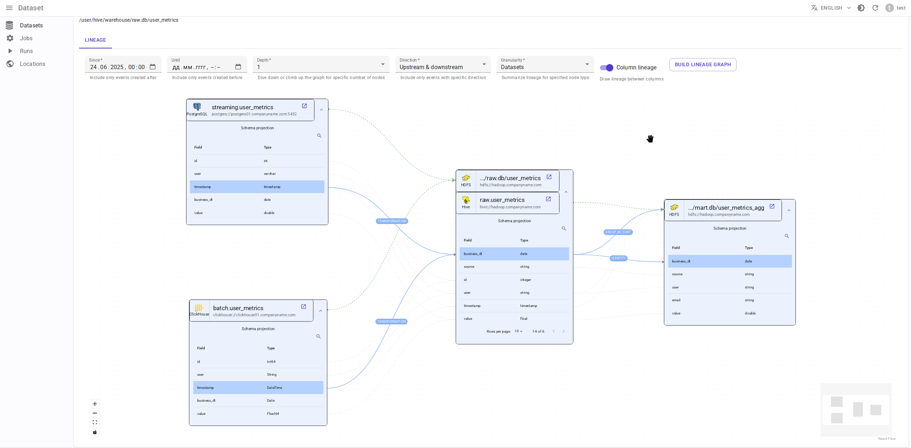
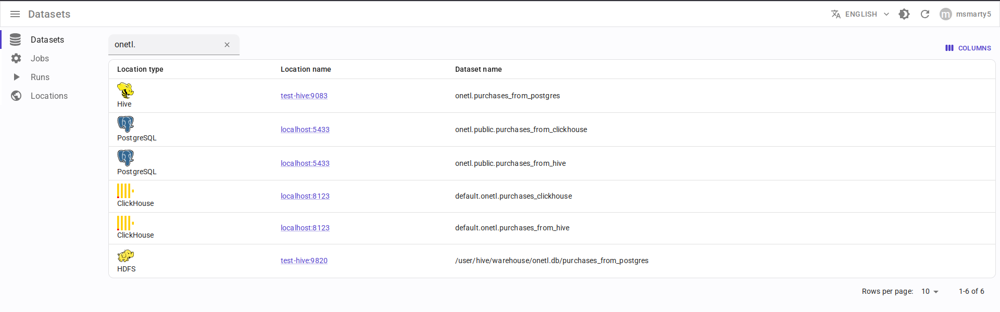
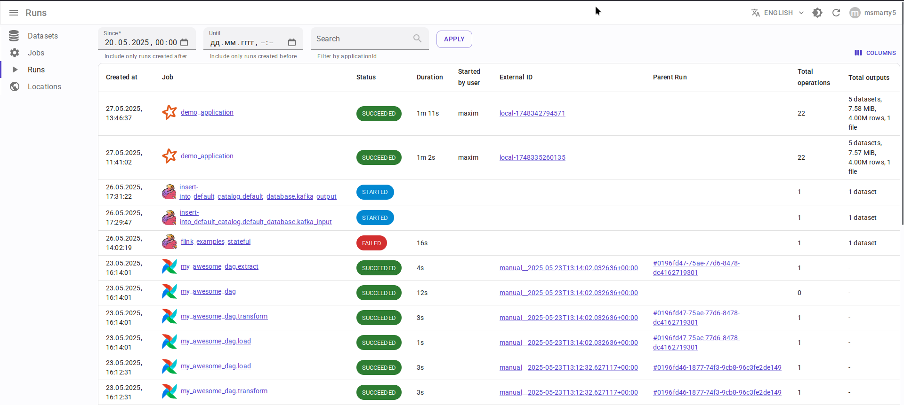
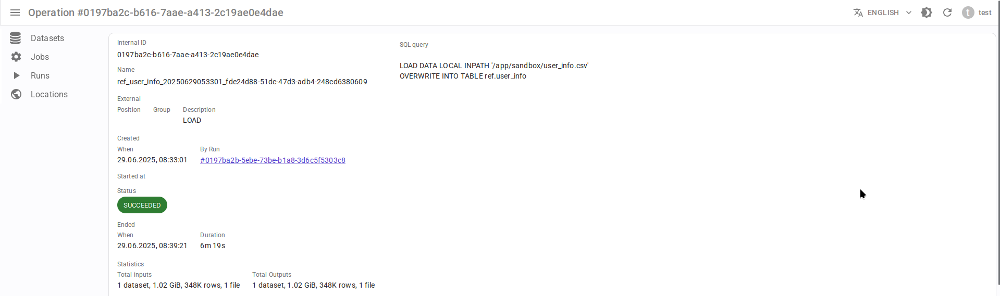
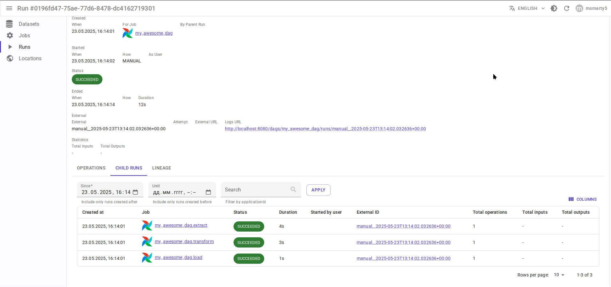

.. toctree::
    :maxdepth: 2
    :caption: Data.Rentgen
    :hidden:

    self

.. toctree::
    :maxdepth: 2
    :caption: Overview
    :hidden:

    quickstart/index
    entities

.. toctree::
    :maxdepth: 2
    :caption: Reference
    :hidden:

    reference/architecture
    reference/database/index
    reference/broker/index
    reference/consumer/index
    reference/server/index
    reference/frontend/index

.. toctree::
    :maxdepth: 2
    :caption: Development
    :hidden:

    changelog
    contributing
    security

.. include:: ../README.rst
    :end-before: |Logo|

.. include raw <svg> instead of <image source=".svg"> to make attribute fill="..." change text color depending on documentation theme
.. raw:: html
    :file: _static/logo_wide.svg

.. include:: ../README.rst
    :start-after: |Logo|
    :end-before: documentation

Screenshots
-----------

Lineage graph
~~~~~~~~~~~~~

Dataset lineage

.. image:: quickstart/spark/dataset_lineage.png
    :alt: Dataset lineage

Column-level lineage

Datasets
~~~~~~~~

Runs
~~~~

Spark application
~~~~~~~~~~~~~~~~~

.. image:: quickstart/spark/job_details.png
    :alt: Spark application details

Spark run
~~~~~~~~~

.. image:: quickstart/spark/run_details.png
    :alt: Spark run details

Spark command
~~~~~~~~~~~~~~~

.. image:: quickstart/spark/operation_details.png
    :alt: Spark command details

Hive query
~~~~~~~~~~

Airflow DagRun
~~~~~~~~~~~~~~~

Airflow TaskInstance
~~~~~~~~~~~~~~~~~~~~~

.. image:: quickstart/airflow/task_run_details.png
    :alt: Airflow TaskInstance details
