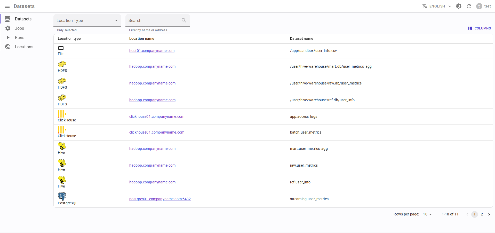
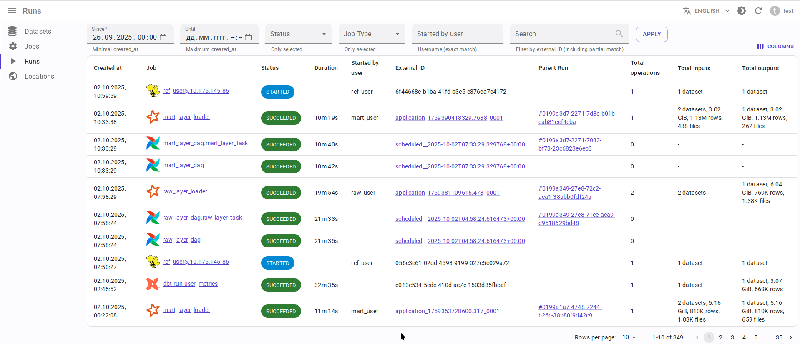
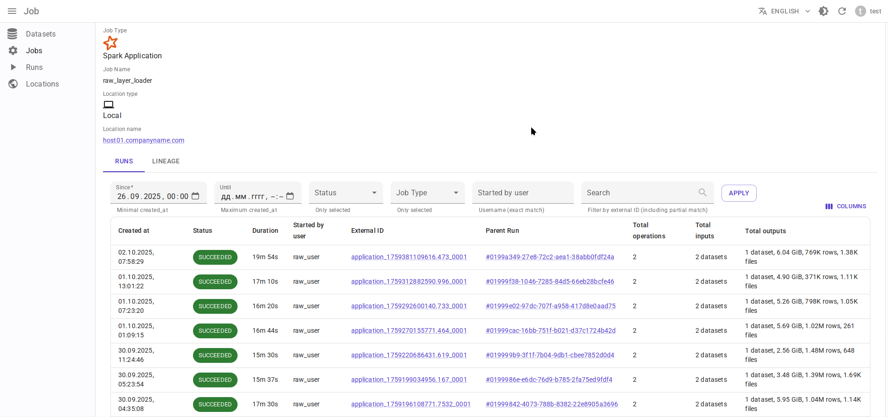
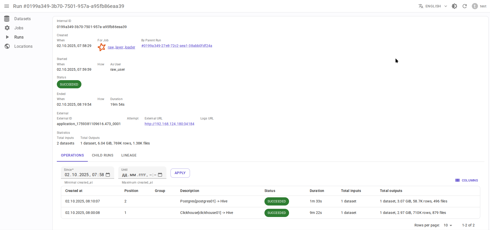
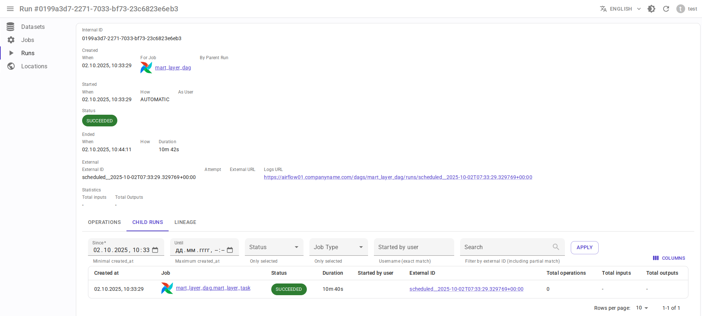

.. toctree::
    :maxdepth: 2
    :caption: Data.Rentgen
    :hidden:

    self
    comparison

.. toctree::
    :maxdepth: 2
    :caption: Quickstart
    :hidden:

    install
    entities/index
    personal_tokens/index

.. toctree::
    :maxdepth: 2
    :caption: Integrations
    :hidden:

    integrations/spark/index
    integrations/airflow/index
    integrations/flink1/index
    integrations/flink2/index
    integrations/hive/index
    integrations/dbt/index

.. toctree::
    :maxdepth: 2
    :caption: Reference
    :hidden:

    reference/architecture
    reference/database/index
    reference/broker/index
    reference/consumer/index
    reference/server/index
    reference/frontend/index
    reference/http2kafka/index

.. toctree::
    :maxdepth: 2
    :caption: Development
    :hidden:

    changelog
    contributing
    security

.. include:: ../README.rst
    :end-before: |Logo|

.. include raw <svg> instead of <image source=".svg"> to make attribute fill="..." change text color depending on documentation theme
.. raw:: html
    :file: _static/logo_wide.svg

.. include:: ../README.rst
    :start-after: |Logo|
    :end-before: documentation

Screenshots
-----------

Lineage graph
~~~~~~~~~~~~~

Dataset-level lineage graph

.. image:: entities/dataset_lineage.png
    :alt: Dataset-level lineage graph

Dataset column-level lineage graph

.. image:: entities/dataset_column_lineage.png
    :alt: Dataset column-level lineage graph

Job-level lineage graph

.. image:: entities/job_lineage.png
    :alt: Job-level lineage graph

Run-level lineage graph

.. image:: entities/run_lineage.png
    :alt: Job-level lineage graph

Datasets
~~~~~~~~

Runs
~~~~

Spark application
~~~~~~~~~~~~~~~~~

Spark run
~~~~~~~~~

Spark command
~~~~~~~~~~~~~~~

.. image:: integrations/spark/operation_details.png
    :alt: Spark command details

Hive query
~~~~~~~~~~

.. image:: integrations/hive/operation_details.png
    :alt: Hive query details

Airflow DagRun
~~~~~~~~~~~~~~~

Airflow TaskInstance
~~~~~~~~~~~~~~~~~~~~~

.. image:: integrations/airflow/task_run_details.png
    :alt: Airflow TaskInstance details
