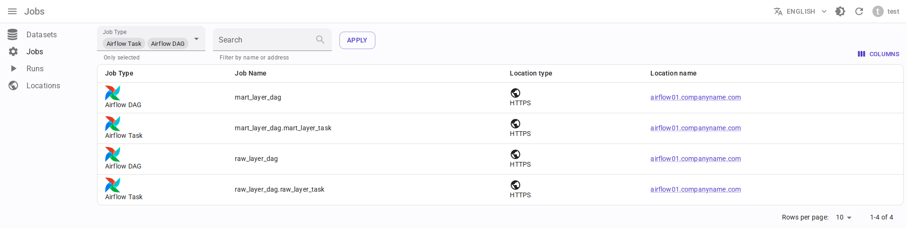
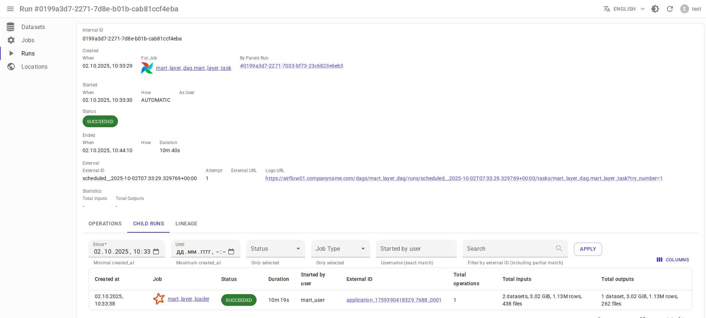

.. _overview-setup-airflow:

Apache Airflow integration
==========================

Using `OpenLineage integration with Apache Airflow <https://openlineage.io/docs/integrations/airflow/>`_.

Requirements
------------

* `Apache Airflow <https://airflow.apache.org/>`_ 2.x or 3.x
* OpenLineage 1.19.0 or higher, recommended 1.40.1+
* OpenLineage integration for Airflow (see below)
* Running :ref:`message-broker`
* (Optional) :ref:`http2kafka`

Entity mapping
--------------

* Airflow DAG → Data.Rentgen Job
* Airflow DAGRun → Data.Rentgen Run
* Airflow Task → Data.Rentgen Job
* Airflow TaskInstance → Data.Rentgen Run + Data.Rentgen Operation

Install
-------

* For Airflow 2.7 or higher, use `apache-airflow-providers-openlineage <https://airflow.apache.org/docs/apache-airflow-providers-openlineage/stable/index.html>`_ 1.9.0 or higher:

  .. tabs::

    .. code-tab:: console KafkaTransport

      $ pip install "apache-airflow-providers-openlineage>=2.6.1" "openlineage-python[kafka]>=1.40.1" zstd

    .. code-tab:: console HttpTransport (requires HTTP2Kafka)

      $ pip install "apache-airflow-providers-openlineage>=2.6.1"

* For Airflow 2.1.x-2.6.x, use `OpenLineage integration for Airflow <https://openlineage.io/docs/integrations/airflow/>`_ 1.19.0 or higher

  .. tabs::

    .. code-tab:: console KafkaTransport

      $ pip install "openlineage-airflow>=1.40.1" "openlineage-python[kafka]>=1.40.1" zstd

    .. code-tab:: console HttpTransport (requires HTTP2Kafka)

      $ pip install "openlineage-airflow>=1.40.1"

Setup
-----

Via OpenLineage config file
~~~~~~~~~~~~~~~~~~~~~~~~~~~

* Create ``openlineage.yml`` file with content like:

  .. tabs::

    .. code-tab:: yaml KafkaTransport

      transport:
          type: kafka
          topic: input.runs
          config:
              # should be accessible from Airflow scheduler
              bootstrap.servers: localhost:9093
              security.protocol: SASL_PLAINTEXT
              sasl.mechanism: SCRAM-SHA-256
              # Kafka auth credentials
              sasl.username: data_rentgen
              sasl.password: changeme
              compression.type: zstd
              acks: all

    .. code-tab:: yaml HttpTransport (requires HTTP2Kafka)

      transport:
          type: http
          # http2kafka URL, should be accessible from Airflow scheduler
          url: http://localhost:8002
          endpoint: /v1/openlineage
          compression: gzip
          auth:
              type: api_key
              # create a PersonalToken, and pass it here
              apiKey: personal_token_AAAAAAAAAAAA.BBBBBBBBBBBBBBBBBBBBBBB.CCCCCCCCCCCCCCCCCCCCC

* Pass path to config file via ``AIRFLOW__OPENLINEAGE__CONFIG_PATH`` environment variable:

  .. code:: ini

      AIRFLOW__OPENLINEAGE__NAMESPACE=http://airflow.hostname.fqdn:8080
      AIRFLOW__OPENLINEAGE__CONFIG_PATH=/path/to/openlineage.yml

Via Airflow config file
~~~~~~~~~~~~~~~~~~~~~~~

Setup OpenLineage integration using ``airflow.cfg`` config file:

.. tabs::

  .. code-tab:: ini KafkaTransport

    [openlineage]
    # set here address of Airflow Web UI
    namespace = http://airflow.hostname.fqdn:8080
    # set here Kafka broker address & auth credentials
    transport = {"type": "kafka", "config": {"bootstrap.servers": "localhost:9093", "security.protocol": "SASL_PLAINTEXT", "sasl.mechanism": "SCRAM-SHA-256", "sasl.username": "data_rentgen", "sasl.password": "changeme", "compression.type": "zstd", "acks": "all"}, "topic": "input.runs", "flush": true}

  .. code-tab:: ini HttpTransport (requires HTTP2Kafka)

    [openlineage]
    # set here address of Airflow Web UI
    namespace = http://airflow.hostname.fqdn:8080
    # set here HTTP2Kafka url & create PersonalToken
    transport = {"type": "http", "url": "http://localhost:8002", "endpoint": "/v1/openlineage", "compression": "gzip", "auth": {"type": "api_key", "apiKey": "personal_token_AAAAAAAAAAAA.BBBBBBBBBBBBBBBBBBBBBBB.CCCCCCCCCCCCCCCCCCCCC"}}

Via Airflow environment variables
~~~~~~~~~~~~~~~~~~~~~~~~~~~~~~~~~

Set environment variables for all Airflow components (e.g. via ``docker-compose.yml``). Depending on your shell, you may remove single quotes

.. tabs::

  .. code-tab:: bash KafkaTransport

    # set here address of Airflow Web UI
    AIRFLOW__OPENLINEAGE__NAMESPACE='http://airflow.hostname.fqdn:8080'
    # set here Kafka broker address & auth credentials
    AIRFLOW__OPENLINEAGE__TRANSPORT='{"type": "kafka", "config": {"bootstrap.servers": "localhost:9093", "security.protocol": "SASL_PLAINTEXT", "sasl.mechanism": "SCRAM-SHA-256", "sasl.username": "data_rentgen", "sasl.password": "changeme", "compression.type": "zstd", "acks": "all"}, "topic": "input.runs", "flush": true}'

  .. code-tab:: bash HttpTransport (requires HTTP2Kafka)

    # set here address of Airflow Web UI
    AIRFLOW__OPENLINEAGE__NAMESPACE='http://airflow.hostname.fqdn:8080'
    # set here HTTP2Kafka url & create PersonalToken
    AIRFLOW__OPENLINEAGE__TRANSPORT='{"type": "http", "url": "http://localhost:8002", "endpoint": "/v1/openlineage", "compression": "gzip", "auth": {"type": "api_key", "apiKey": "personal_token_AAAAAAAAAAAA.BBBBBBBBBBBBBBBBBBBBBBB.CCCCCCCCCCCCCCCCCCCCC"}}'

Airflow 2.1.x and 2.2.x
~~~~~~~~~~~~~~~~~~~~~~~

For Airflow 2.1-2.2 it OpenLineage integration should be enabled explicitly by adding ``airflow.cfg`` config entry:

.. code:: ini

    [lineage]
    backend=openlineage.lineage_backend.OpenLineageBackend

Or by setting up environment variable:

.. code:: ini

    AIRFLOW__LINEAGE__BACKEND=openlineage.lineage_backend.OpenLineageBackend

Collect and send lineage
------------------------

Run some Airflow dag with tasks, and wait until finished.
Lineage will be send to Data.Rentgen automatically by OpenLineage integration.

See results
-----------

Browse frontend page `Jobs <http://localhost:3000/jobs>`_ to see what information was extracted by OpenLineage & DataRentgen.

Job list page
~~~~~~~~~~~~~

DAG job details page
~~~~~~~~~~~~~~~~~~~~

.. image:: ./dag_job_details.png

DAG run details page
~~~~~~~~~~~~~~~~~~~~

.. image:: ./dag_run_details.png

Task job details page
~~~~~~~~~~~~~~~~~~~~

.. image:: ./task_job_details.png

Task run details page
~~~~~~~~~~~~~~~~~~~~~

Extra configuration
-------------------

Collecting DAG tags
~~~~~~~~~~~~~~~~~~~

By default, following job tags are created:

- ``airflow.version``
- ``openlineage_adapter.version``
- ``openlineage_client.version`` (using OpenLineage client 1.38.0+)

If is possible to provide custom DAG tags as well. But DataRentgen is able to extract only tags in format ``key:value``, e.g.:

.. code-block:: python
    :caption: mydag.py

    from airflow.models import DAG

    with DAG(
        dag_id="mydag",
        tags=["environment:production", "layer:bronze"],
    )
