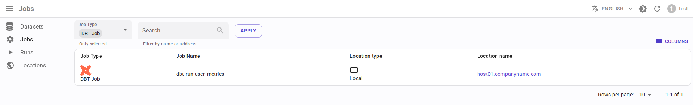
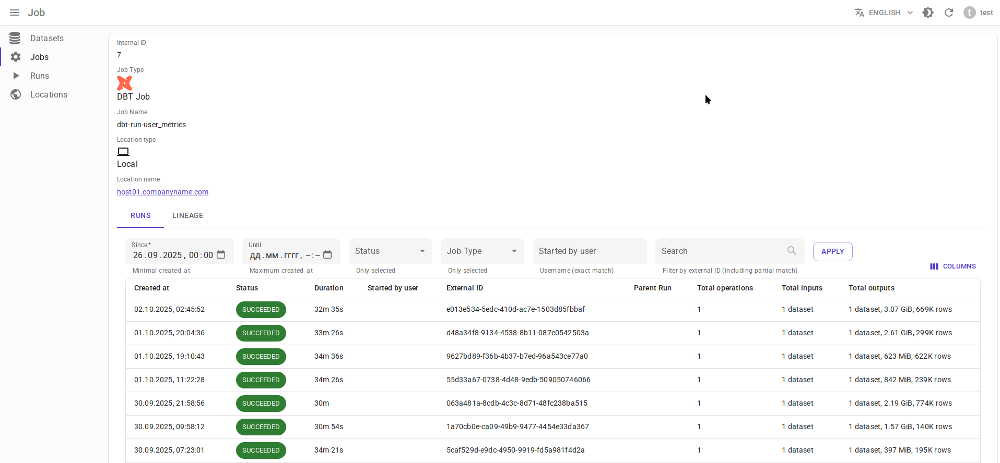

.. _overview-setup-dbt:

dbt integration
===============

Using `OpenLineage integration with dbt <https://openlineage.io/docs/integrations/dbt>`_.

Requirements
------------

* `dbt <https://www.getdbt.com/>`_ 1.3 or higher
* OpenLineage 1.19.0 or higher, recommended 1.40.1+
* Running :ref:`message-broker`
* (Optional) :ref:`http2kafka`

Limitations
-----------

* Currently there is no way to pass dataset tags, `see issue <https://github.com/OpenLineage/OpenLineage/issues/3500>`_.

Entity mapping
--------------

* dbt project → Data.Rentgen Job
* dbt run → Data.Rentgen Run
* dbt model, snapshot, sql, test → Data.Rentgen Operation

Install
-------

.. tabs::

  .. code-tab:: console KafkaTransport

    $ pip install "openlineage-dbt>=1.40.1" "openlineage-python[kafka]>=1.40.1" zstd

  .. code-tab:: console HttpTransport (requires HTTP2Kafka)

    $ pip install "openlineage-dbt>=1.40.1"

Setup
-----

* Create ``openlineage.yml`` file with content like:

  .. tabs::

    .. code-tab:: yaml KafkaTransport

      transport:
          type: kafka
          topic: input.runs
          config:
              # should be accessible from host
              bootstrap.servers: localhost:9093
              security.protocol: SASL_PLAINTEXT
              sasl.mechanism: SCRAM-SHA-256
              # Kafka auth credentials
              sasl.username: data_rentgen
              sasl.password: changeme
              compression.type: zstd
              acks: all

    .. code-tab:: yaml HttpTransport (requires HTTP2Kafka)

      transport:
          # "type: http" for OpenLineage below 1.35.0
          type: async_http
          # http2kafka URL, should be accessible from host
          url: http://localhost:8002
          endpoint: /v1/openlineage
          compression: gzip
          auth:
              type: api_key
              # create a PersonalToken, and pass it here
              apiKey: personal_token_AAAAAAAAAAAA.BBBBBBBBBBBBBBBBBBBBBBB.CCCCCCCCCCCCCCCCCCCCC

* Set environment variables:

  .. code:: ini

      OPENLINEAGE_NAMESPACE=local://dbt.host.name
      OPENLINEAGE_CONFIG=/path/to/openlineage.yml

Collect and send lineage
------------------------

Replace ``dbt`` CLI commands:

.. code:: shell

    $ dbt run myproject
    $ dbt test myproject

with ``dbt-ol`` CLI:

.. code:: shell

    $ dbt-ol run myproject
    $ dbt-ol test myproject

Lineage will be send to Data.Rentgen automatically by OpenLineage integration.

See results
-----------

Browse frontend page `Jobs <http://localhost:3000/jobs>`_ to see what information was extracted by OpenLineage & DataRentgen

Job list page
~~~~~~~~~~~~~

Job details page
~~~~~~~~~~~~~~~~

Job-level lineage
~~~~~~~~~~~~~~~~~

.. image:: ./job_lineage.png

Run details
~~~~~~~~~~~

.. image:: ./run_details.png

Run lineage
~~~~~~~~~~~

.. image:: ./run_lineage.png

Operation details
~~~~~~~~~~~~~~~~~

.. image:: ./operation_details.png

Operation lineage
~~~~~~~~~~~~~~~~~

.. image:: ./operation_lineage.png

Extra configuration
-------------------

Collecting model tags
~~~~~~~~~~~~~~~~~~~~~

By default, following job tags are created:

- ``dbt.version``
- ``openlineage_adapter.version``
- ``openlineage_client.version`` (using OpenLineage client 1.38.0+)

It is possible to provide custom tags via model config:

.. code-block:: yaml
    :caption: dbt_project.yaml

    models:
    jaffle_shop:
        materialized: table
        staging:
            materialized: view
        +tags:
            - environment:production
            - layer:bronze
