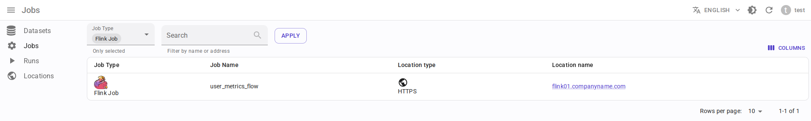
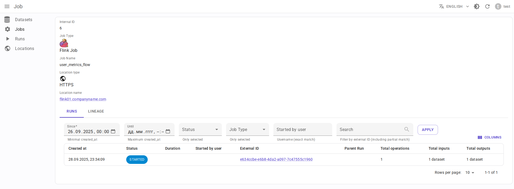

.. _overview-setup-flink1:

Apache Flink 1.x integration
============================

Using `OpenLineage integration with Apache Flink 1.x <https://openlineage.io/docs/integrations/flink/flink1>`_.

Requirements
------------

* `Apache Flink <https://flink.apache.org/>`_ 1.x
* OpenLineage 1.31.0 or higher, recommended 1.40.1+
* Running :ref:`message-broker`
* (Optional) :ref:`http2kafka`

Limitations
-----------

* Only ``standalone-job`` (application mode) is supported, but not ``jobmanager`` (session mode): `OpenLineage issue <https://github.com/OpenLineage/OpenLineage/issues/2150>`_
* Currently there is no way to pass job tags, `see issue <https://github.com/OpenLineage/OpenLineage/issues/4280>`_.

Entity mapping
--------------

* Flink job → Data.Rentgen Job
* Flink job run → Data.Rentgen Run + Data.Rentgen Operation

Installation
------------

* Add dependencies `openlineage-flink <https://mvnrepository.com/artifact/io.openlineage/openlineage-flink>`_ and `kafka-clients <https://mvnrepository.com/artifact/org.apache.kafka/kafka-clients>`_ to your Flink job:

  .. code-block:: groovy
    :caption: build.gradle

    implementation "io.openlineage:openlineage-flink:1.40.1"
    // For KafkaTransport only
    implementation "org.apache.kafka:kafka-clients:3.9.0"

* Register ``OpenLineageFlinkJobListener`` in the code of your Flink job:

  .. code-block:: java
    :caption: MyFlinkJob.java

    import io.openlineage.flink.OpenLineageFlinkJobListener;

    StreamExecutionEnvironment env = StreamExecutionEnvironment.getExecutionEnvironment();

    JobListener listener = OpenLineageFlinkJobListener.builder()
        .executionEnvironment(env)
        .build();
    env.registerJobListener(listener);

Setup
-----

* Modify Flink ``config.yaml`` to include:

  .. code-block:: yaml
    :caption: config.yaml

    execution.attached: true  # capture job stop events

* Create ``openlineage.yml`` file with content like:

  .. tabs::

    .. code-tab:: yaml KafkaTransport
      :caption: openlineage.yaml

      job:
          # set namespace to match Flink address
          namespace: http://some.host.name:18081
          # set job name
          name: flink_examples_stateful

      # Send RUNNING event every 1 hour.
      # Using default interval (1 minute) just floods Kafka with useless RUNNING events.
      trackingIntervalInSeconds: 3600

      transport:
          type: kafka
          topicName: input.runs
          properties:
              # should be accessible inside jobmanager container
              # not using localhost in docker!
              bootstrap.servers: broker:9092
              security.protocol: SASL_PLAINTEXT
              sasl.mechanism: SCRAM-SHA-256
              # Kafka auth credentials
              sasl.jaas.config: |
                  org.apache.kafka.common.security.scram.ScramLoginModule required
                  username="data_rentgen"
                  password="changeme";
              key.serializer: org.apache.kafka.common.serialization.StringSerializer
              value.serializer: org.apache.kafka.common.serialization.StringSerializer
              compression.type: zstd
              acks: all

    .. code-tab:: yaml HttpTransport (requires HTTP2Kafka)
      :caption: openlineage.yaml

      job:
          # set namespace to match Flink address
          namespace: http://some.host.name:18081
          # set job name
          name: flink_examples_stateful

      # Send RUNNING event every 1 hour.
      # Using default interval (1 minute) just floods Kafka with useless RUNNING events.
      trackingIntervalInSeconds: 3600

      transport:
          type: http
          # should be accessible inside jobmanager container
          # not using localhost in docker!
          url: http://http2kafka:8000
          endpoint: /v1/openlineage
          compression: gzip
          auth:
              type: api_key
              # create a PersonalToken, and pass it here
              apiKey: personal_token_AAAAAAAAAAAA.BBBBBBBBBBBBBBBBBBBBBBB.CCCCCCCCCCCCCCCCCCCCC

* Pass path to config file via ``OPENLINEAGE_CONFIG`` environment variable of ``jobmanager``:

  .. code:: bash

    OPENLINEAGE_CONFIG=/path/to/openlineage.yml

At the end, this should look like this (see `Official documentation <https://nightlies.apache.org/flink/flink-docs-release-1.20/docs/deployment/resource-providers/standalone/docker/>`_):

.. code-block:: yaml
    :caption: docker-compose.yml

    services:
        jobmanager:
            image: flink:1.20.1-scala_2.12-java11
            ports:
            - "18081:8081"
            # only standalone-job is supported
            command: standalone-job --job-classname my.awesome.FlinkStatefulApplication
            volumes:
            - ./artifacts/:/opt/flink/usrlib/  # path to you Flink Job .jar files
            - ./config.yaml:/opt/flink/conf/config.yaml
            - ./openlineage.yml:/opt/flink/conf/openlineage.yml
            environment:
            - OPENLINEAGE_CONFIG=/path/to/openlineage.yml

        taskmanager:
            image: flink:1.20.1-scala_2.12-java11
            depends_on:
            - jobmanager
            command: taskmanager
            volumes:
            - ./artifacts/:/opt/flink/usrlib/  # path to you Flink Job .jar files
            - ./config.yaml:/opt/flink/conf/config.yaml

Collect and send lineage
------------------------

Just start your Flink job. OpenLineage integration will automatically collect and send lineage to DataRentgen.

See results
-----------

Browse frontend pages `Jobs <http://localhost:3000/jobs>`_ to see what information was extracted by OpenLineage & DataRentgen.

Job list page
~~~~~~~~~~~~~

Job details page
~~~~~~~~~~~~~~~~

Run details page
~~~~~~~~~~~~~~~~

.. image:: ./run_details.png

Dataset level lineage
~~~~~~~~~~~~~~~~~~~~~

.. image:: ./dataset_lineage.png

Job level lineage
~~~~~~~~~~~~~~~~~

.. image:: ./job_lineage.png

Run level lineage
~~~~~~~~~~~~~~~~~

.. image:: ./run_lineage.png
