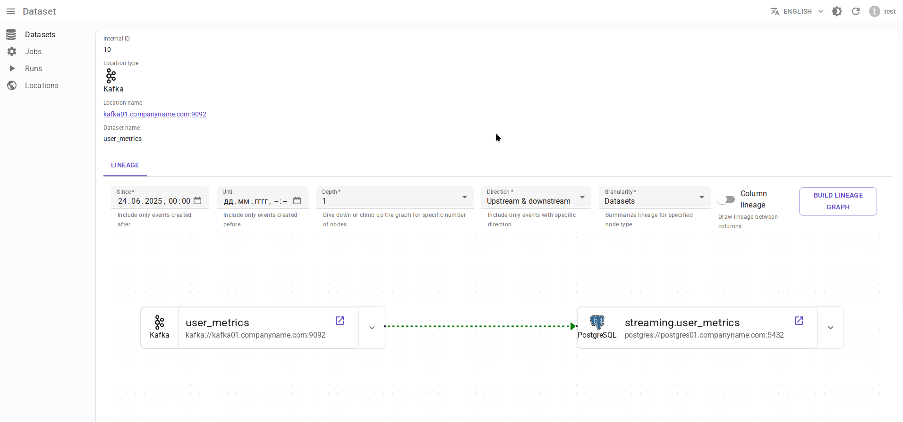

.. _overview-setup-flink2:

Apache Flink 2.x integration
============================

Using `OpenLineage integration with Apache Flink 2.x <https://openlineage.io/docs/integrations/flink/flink2>`_.

Requirements
------------

* `Apache Flink <https://flink.apache.org/>`_ 2.x
* OpenLineage 1.31.0 or higher, recommended 1.33.0+

Entity mapping
--------------

* Flink job → Data.Rentgen Job
* Flink job run → Data.Rentgen Run + Data.Rentgen Operation

Installation
------------

* Download these jars and place then in ``/path/to/jars/`` directory:

  * `openlineage-java <https://mvnrepository.com/artifact/io.openlineage/openlineage-java>`_
  * `openlineage-flink <https://mvnrepository.com/artifact/io.openlineage/openlineage-flink>`_
  * `kafka-clients <https://mvnrepository.com/artifact/org.apache.kafka/kafka-clients>`_
  * `zstd-jni <https://mvnrepository.com/artifact/com.github.luben/zstd-jni>`_

* Set environment variable ``CLASSPATH`` of Flink's ``JobManager`` to point to this directory path:

  .. code:: ini

      CLASSPATH=/path/to/jars/

* Configure Flink ``JobManager`` to load these dependencies using its own ClassLoader:

  .. code-block:: yaml
    :caption: config.yaml

    classloader.parent-first-patterns.additional: ["io.openlineage.", "org.apache.kafka.","com.github.luben."]

  Otherwise Flink will load all classes from job's classloader, and this could lead to errors like:

  .. code:: text

      org.apache.kafka.common.KafkaException: class org.apache.kafka.common.serialization.StringSerializer is not an instance of org.apache.kafka.common.serialization.Serializer
      java.util.ServiceConfigurationError: io.openlineage.client.transports.TransportBuilder: io.openlineage.client.transports.HttpTransportBuilder not a subtype

  See `Flink documentation <https://nightlies.apache.org/flink/flink-docs-release-2.0/docs/deployment/config/#class-loading>`_ for more details.

Setup
-----

* Add ``OpenLineageJobStatusChangedListenerFactory`` to Flink config:

  .. code-block:: yaml
    :caption: config.yaml

    execution.job-status-changed-listeners: io.openlineage.flink.listener.OpenLineageJobStatusChangedListenerFactory  # capture job event
    execution.attached: true  # capture job stop events

* Create ``openlineage.yml`` file with content like:

  .. code-block:: yaml
    :caption: openlineage.yml

    job:
        namespace: http://some.host.fqdn:18081  # set namespace to match Flink address
        name: flink_examples_stateful  # set job name

    transport:
        type: kafka
        topicName: input.runs
        properties:
            bootstrap.servers: localhost:9093
            security.protocol: SASL_PLAINTEXT
            sasl.mechanism: SCRAM-SHA-256
            sasl.jaas.config: |
                org.apache.kafka.common.security.scram.ScramLoginModule required
                username="data_rentgen"
                password="changeme";
            key.serializer: org.apache.kafka.common.serialization.StringSerializer
            value.serializer: org.apache.kafka.common.serialization.StringSerializer
            compression.type: zstd
            acks: all

* Pass path to config file via ``OPENLINEAGE_CONFIG`` environment variable of ``JobManager``:

  .. code:: ini

    OPENLINEAGE_CONFIG=/path/to/openlineage.yml

Collect and send lineage
------------------------

Just start your Flink job. OpenLineage integration will automatically collect and send lineage to DataRentgen.

See results
-----------

Browse frontend pages `Jobs <http://localhost:3000/jobs>`_ to see what information was extracted by OpenLineage & DataRentgen.

Job list page
~~~~~~~~~~~~~

.. image:: ../flink1/job_list.png

Job details page
~~~~~~~~~~~~~~~~

.. image:: ../flink1/job_details.png

Run details page
~~~~~~~~~~~~~~~~

.. image:: ../flink1/run_details.png

Dataset level lineage
~~~~~~~~~~~~~~~~~~~~~

Job level lineage
~~~~~~~~~~~~~~~~~

.. image:: ../flink1/job_lineage.png

Run level lineage
~~~~~~~~~~~~~~~~~

.. image:: ../flink1/run_lineage.png
