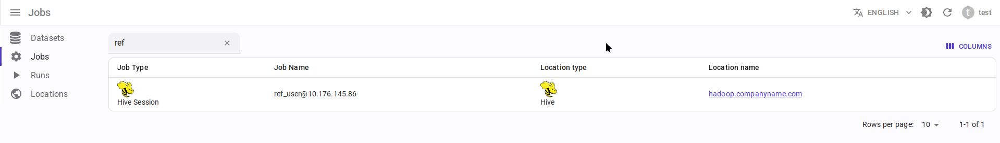

.. _overview-setup-hive:

Apache Hive integration
============================

Using `OpenLineage integration with Apache Hive <https://openlineage.io/docs/integrations/hive/>`_.

Requirements
------------

* `Apache Hive <https://hive.apache.org/>`_ 3.1.3 (4.0 is not yet supported)
* OpenLineage 1.34.0 or higher, recommended 1.35.0+

Limitations
-----------

* **Hive CLI** is not supported. HiveServer2 is required.
* As for OpenLineage 1.34.0 version only these queries are parsed as containing lineage:

  * ``CREATE TABLE .. AS SELECT ...``
  * ``INSERT INTO ... SELECT ...``

  Other query types are ignored by OpenLineage integration, including:

  * ``CREATE TABLE ...``, ``ALTER TABLE ...``, ``TRUNCATE TABLE ...``, ``DROP TABLE ...``.
  * ``INSERT INTO ... VALUES ...``, ``UPDATE``, ``DELETE``, ``MERGE``.
  * ``LOAD DATA``, ``EXPORT``, ``IMPORT``.
  * ``SELECT`` data directly to JDBC client.

Entity mapping
--------------

* Hive user + user IP → Data.Rentgen Job
* Hive session → Data.Rentgen Run
* Hive query → Data.Rentgen Operation

Installation
------------

Download these jars and place then in ``/path/to/jars/`` directory on HiveServer2 machine:

* `openlineage-java <https://mvnrepository.com/artifact/io.openlineage/openlineage-java>`_
* `openlineage-hive <https://mvnrepository.com/artifact/io.openlineage/openlineage-hive>`_
* `kafka-clients <https://mvnrepository.com/artifact/org.apache.kafka/kafka-clients>`_
* `zstd-jni <https://mvnrepository.com/artifact/com.github.luben/zstd-jni>`_

Setup
-----

Change ``hive-site.xml`` configuration file:

.. code:: xml

    <?xml version="1.0" encoding="UTF-8"?>
    <configuration>
        <!-- Set Hive to stop complaining on unknown properties -->
        <property>
            <name>hive.conf.validation</name>
            <value>false</value>
        </property>

        <!-- Set path to downloaded jars -->
        <property>
            <name>hive.aux.jars.path</name>
            <value>/path/to/jars/</value>
        </property>

        <!-- Enable OpenLineage integration based on Hive hooks -->
        <property>
            <name>hive.server2.session.hook</name>
            <value>io.openlineage.hive.hooks.HiveOpenLineageHook</value>
        </property>
        <property>
            <name>hive.exec.post.hooks</name>
            <value>io.openlineage.hive.hooks.HiveOpenLineageHook</value>
        </property>
        <property>
            <name>hive.exec.failure.hooks</name>
            <value>io.openlineage.hive.hooks.HiveOpenLineageHook</value>
        </property>

        <!-- Setup OpenLineage Kafka transport -->
        <property>
            <name>hive.openlineage.transport.type</name>
            <value>kafka</value>
        </property>
        <property>
            <name>hive.openlineage.transport.topicName</name>
            <value>input.runs</value>
        </property>
        <property>
            <name>hive.openlineage.transport.properties.bootstrap.servers</name>
            <!-- Address should be accessible from HiveServer2 -->
            <value>localhost:9093</value>
        </property>
        <property>
            <name>hive.openlineage.transport.properties.security.protocol</name>
            <value>SASL_PLAINTEXT</value>
        </property>
        <property>
            <name>hive.openlineage.transport.properties.sasl.mechanism</name>
            <value>SCRAM-SHA-256</value>
        </property>
        <property>
            <name>hive.openlineage.transport.properties.sasl.jaas.config</name>
            <value>org.apache.kafka.common.security.scram.ScramLoginModule required username="data_rentgen" password="changeme";</value>
        </property>
        <property>
            <name>hive.openlineage.transport.properties.key.serializer</name>
            <value>org.apache.kafka.common.serialization.StringSerializer</value>
        </property>
        <property>
            <name>hive.openlineage.transport.properties.value.serializer</name>
            <value>org.apache.kafka.common.serialization.StringSerializer</value>
        </property>
        <property>
            <name>hive.openlineage.transport.properties.compression.type</name>
            <value>zstd</value>
        </property>
        <property>
            <name>hive.openlineage.transport.properties.acks</name>
            <value>all</value>
        </property>

        <!-- Set default namespace for jobs -->
        <property>
            <name>hive.openlineage.namespace</name>
            <value>hive://my.hive.host:10000</value>
        </property>
    </configuration>

Collect and send lineage
------------------------

Connect to you HiveServer2 instance JDBC interface, e.g. using ``beeline`` or DBeaver.
After query was executed, integration will send lineage events to DataRentgen.

.. note::

  By default, Job is created with name ``{username}@{clientIp}``. You can override this name by executing this statement:

  .. code:: sql

    SET hive.openlineage.job.name=my_session_name;

See results
-----------

Browse frontend pages `Jobs <http://localhost:3000/jobs>`_ to see what information was extracted by OpenLineage & DataRentgen.

Job list page
~~~~~~~~~~~~~

Job details page
~~~~~~~~~~~~~~~~

.. image:: ./job_details.png

Run details page
~~~~~~~~~~~~~~~~

.. image:: ./run_details.png

Operation details page
~~~~~~~~~~~~~~~~~~~~~~

.. image:: ./operation_details.png

Dataset level lineage
~~~~~~~~~~~~~~~~~~~~~

.. image:: ./dataset_lineage.png

Job level lineage
~~~~~~~~~~~~~~~~~

.. image:: ./job_lineage.png

Run level lineage
~~~~~~~~~~~~~~~~~

.. image:: ./run_lineage.png

Operation level lineage
~~~~~~~~~~~~~~~~~~~~~~~

.. image:: ./operation_lineage.png
