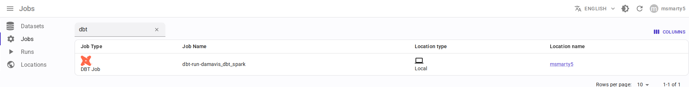
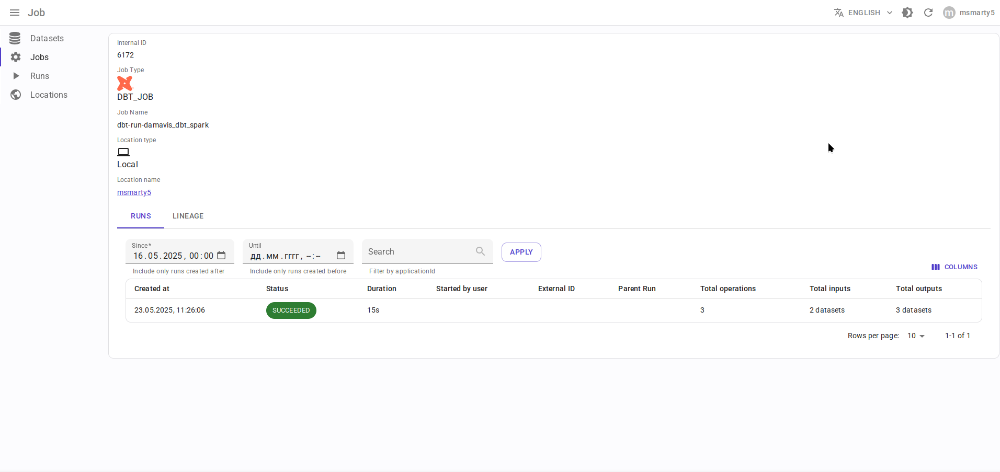
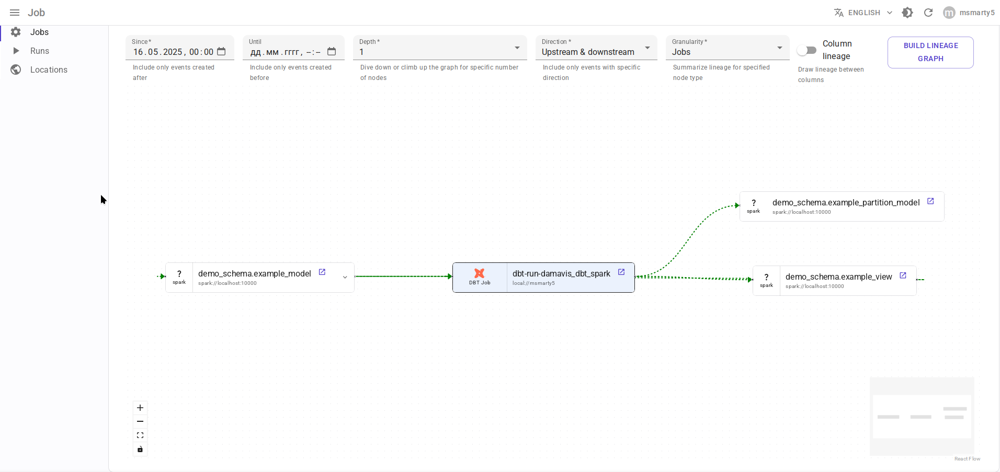
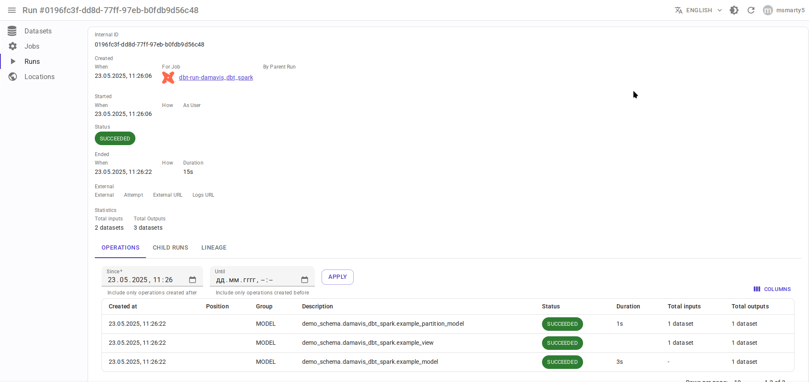
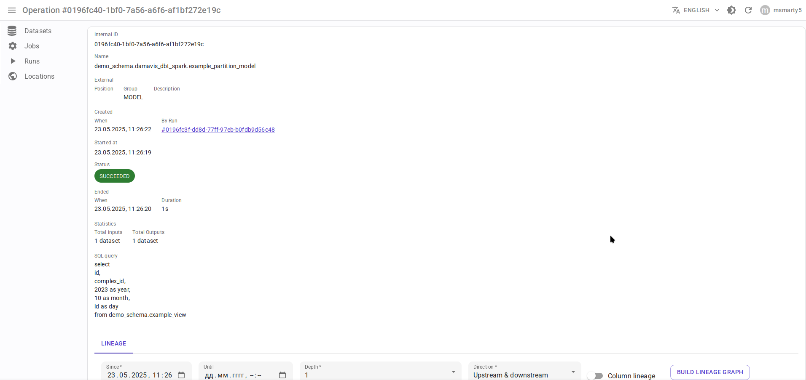
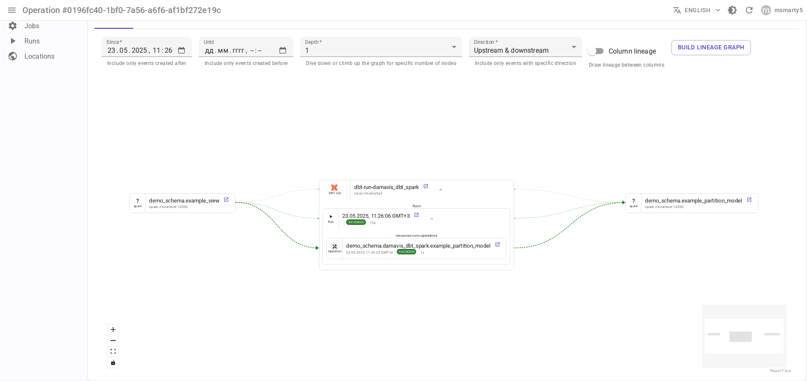

.. _overview-setup-dbt:

dbt integration
===============

Using `OpenLineage integration with dbt <https://openlineage.io/docs/integrations/dbt>`_.

Requirements
------------

* `dbt <https://www.getdbt.com/>`_ 1.3 or higher
* OpenLineage 1.19.0 or higher, recommended 1.33.0+

Entity mapping
--------------

* dbt project → Data.Rentgen Job
* dbt run → Data.Rentgen Run
* dbt model, snapshot, sql, test → Data.Rentgen Operation

Install
-------

.. code:: console

    $ pip install "openlineage-dbt>=1.33.0" "openlineage-python[kafka]>=1.33.0" zstd

Setup
-----

* Create ``openlineage.yml`` file with content below`:

  .. code:: yaml

    transport:
        type: kafka
        topic: input.runs
        config:
            bootstrap.servers: localhost:9093
            security.protocol: SASL_PLAINTEXT
            sasl.mechanism: SCRAM-SHA-256
            sasl.username: data_rentgen
            sasl.password: changeme
            compression.type: zstd
            acks: all

* Set environment variables:

  .. code:: ini

      OPENLINEAGE_NAMESPACE=local://dbt.host.name
      OPENLINEAGE_CONFIG=/path/to/openlineage.yml

Collect and send lineage
------------------------

Replace ``dbt`` CLI commands:

.. code:: shell

    $ dbt run myproject
    $ dbt test myproject

with ``dbt-ol`` CLI:

.. code:: shell

    $ dbt-ol run myproject
    $ dbt-ol test myproject

Lineage will be send to Data.Rentgen automatically by OpenLineage integration.

See results
-----------

Browse frontend page `Jobs <http://localhost:3000/jobs>`_ to see what information was extracted by OpenLineage & DataRentgen

Job list page
~~~~~~~~~~~~~

Job details page
~~~~~~~~~~~~~~~~

Job-level lineage
~~~~~~~~~~~~~~~~~

Run details
~~~~~~~~~~~

Operation details
~~~~~~~~~~~~~~~~~

Operation lineage
~~~~~~~~~~~~~~~~~

