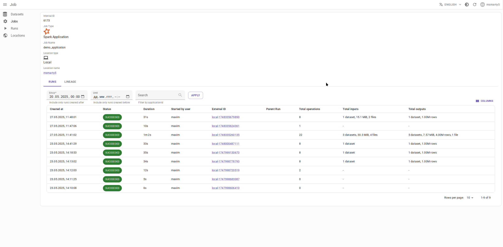
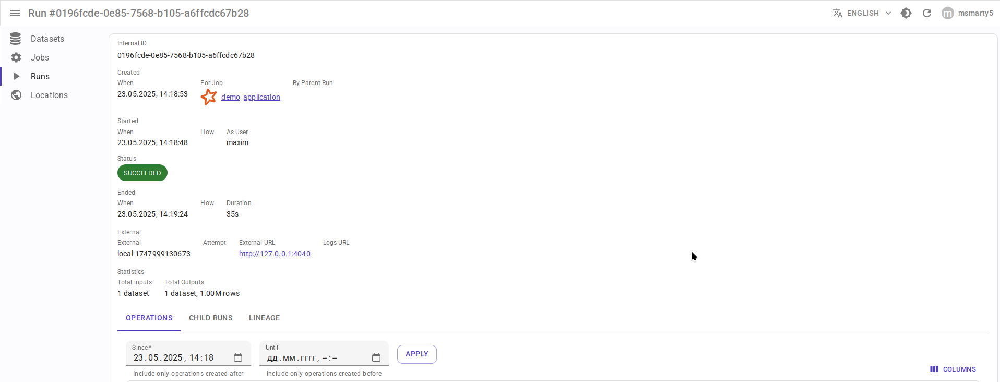
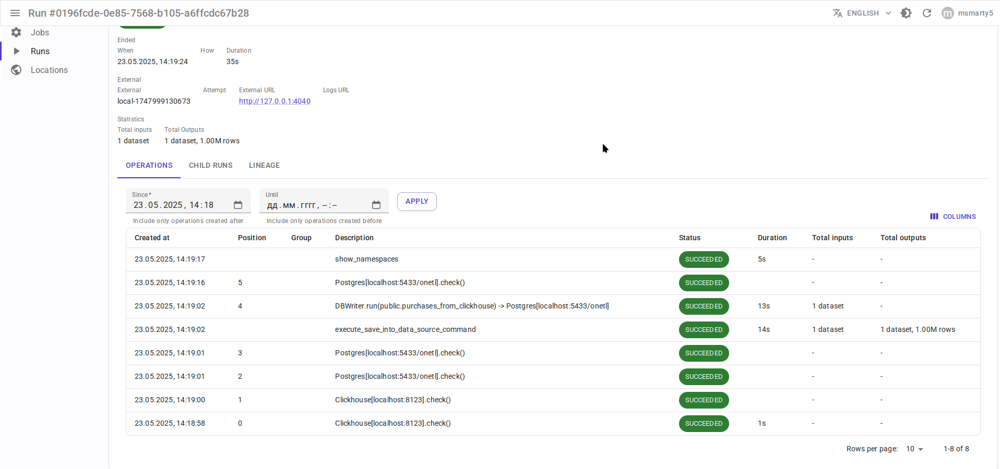
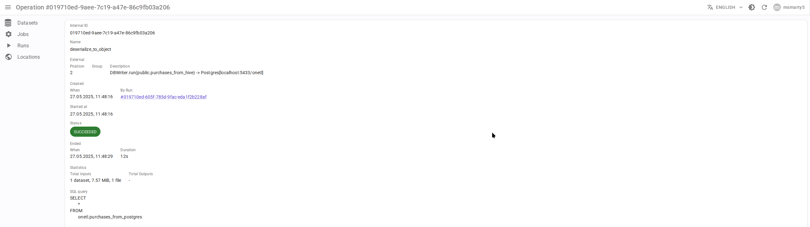
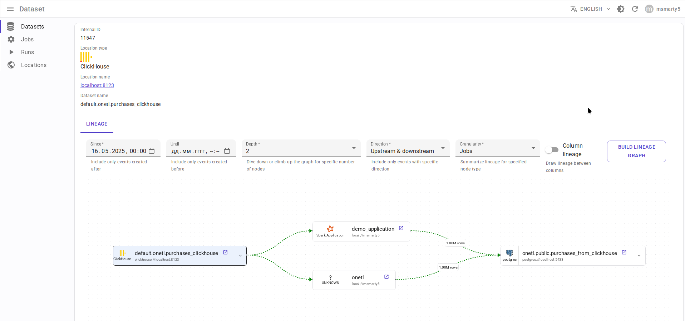
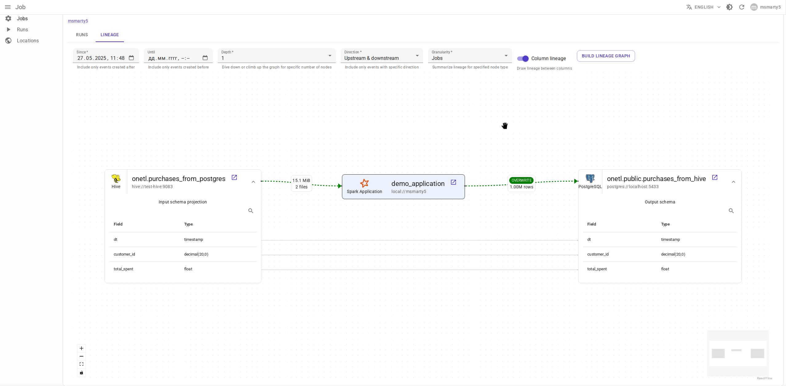
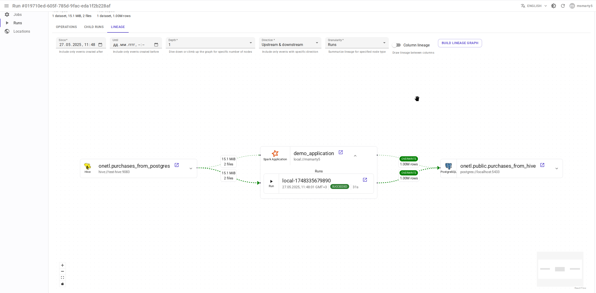

.. _overview-setup-spark:

Apache Spark integration
========================

Using `OpenLineage integration with Apache Spark <https://openlineage.io/docs/integrations/spark/>`_.

Requirements
------------

* `Apache Spark <https://spark.apache.org/>`_ 3.x or higher
* OpenLineage 1.23.0 or higher, recommended 1.33.0+

Entity mapping
--------------

* Spark applicationName → Data.Rentgen Job
* Spark applicationId → Data.Rentgen Run
* Spark job, execution, RDD → Data.Rentgen Operation

Setup
-----

Via OpenLineage config file
~~~~~~~~~~~~~~~~~~~~~~~~~~~

* Create ``openlineage.yml`` file with content like:

  .. code:: yaml

    transport:
        type: kafka
        topicName: input.runs
        properties:
            bootstrap.servers: localhost:9093
            security.protocol: SASL_PLAINTEXT
            sasl.mechanism: SCRAM-SHA-256
            sasl.jaas.config: |
                org.apache.kafka.common.security.scram.ScramLoginModule required
                username="data_rentgen"
                password="changeme";
            key.serializer: org.apache.kafka.common.serialization.StringSerializer
            value.serializer: org.apache.kafka.common.serialization.StringSerializer
            compression.type: zstd
            acks: all

* Pass path to config file via ``OPENLINEAGE_CONFIG`` environment variable:

  .. code:: ini

      OPENLINEAGE_NAMESPACE=local://hostname.as.fqdn
      OPENLINEAGE_CONFIG=/path/to/openlineage.yml

* Setup ``OpenLineageSparkListener`` via SparkSession config:

.. code:: python

    from pyspark.sql import SparkSession

    spark = (
        SparkSession.builder
        # install OpenLineage integration and Kafka client
        .config(
            "spark.jars.packages",
            "io.openlineage:openlineage-spark_2.12:1.33.0,org.apache.kafka:kafka-clients:3.9.0",
        )
        .config(
            "spark.extraListeners", "io.openlineage.spark.agent.OpenLineageSparkListener"
        )
        # set Spark session master & applicationName
        .master("local")
        .appName("mysession")
        # few other important options
        .config("spark.openlineage.jobName.appendDatasetName", "false")
        .config("spark.openlineage.columnLineage.datasetLineageEnabled", "true")
        .getOrCreate()
    )

Via ``SparkSession`` config
~~~~~~~~~~~~~~~~~~~~~~~~~~~

Add OpenLineage integration package, setup ``OpenLineageSparkListener`` in SparkSession config:

.. code:: python

    from pyspark.sql import SparkSession

    spark = (
        SparkSession.builder
        # install OpenLineage integration and Kafka client
        .config(
            "spark.jars.packages",
            "io.openlineage:openlineage-spark_2.12:1.33.0,org.apache.kafka:kafka-clients:3.9.0",
        )
        .config(
            "spark.extraListeners", "io.openlineage.spark.agent.OpenLineageSparkListener"
        )
        # set Spark session master & applicationName
        .master("local")
        .appName("mysession")
        # set here location of Spark session, e.g. current host, YARN cluster or K8s cluster:
        .config("spark.openlineage.namespace", "local://hostname.as.fqdn")
        # .config("spark.openlineage.namespace", "yarn://some-cluster")
        # .config("spark.openlineage.namespace", "k8s://some-cluster")
        .config("spark.openlineage.transport.type", "kafka")
        # set here Kafka connection address & credentials
        .config("spark.openlineage.transport.topicName", "input.runs")
        .config(
            "spark.openlineage.transport.properties.bootstrap.servers", "localhost:9093"
        )
        .config(
            "spark.openlineage.transport.properties.security.protocol", "SASL_PLAINTEXT"
        )
        .config("spark.openlineage.transport.properties.sasl.mechanism", "SCRAM-SHA-256")
        .config(
            "spark.openlineage.transport.properties.sasl.jaas.config",
            'org.apache.kafka.common.security.scram.ScramLoginModule required username="data_rentgen" password="changeme";',
        )
        .config("spark.openlineage.transport.properties.acks", "all")
        .config(
            "spark.openlineage.transport.properties.key.serializer",
            "org.apache.kafka.common.serialization.StringSerializer",
        )
        .config(
            "spark.openlineage.transport.properties.value.serializer",
            "org.apache.kafka.common.serialization.StringSerializer",
        )
        .config("spark.openlineage.transport.properties.compression.type", "zstd")
        # few other important options
        .config("spark.openlineage.jobName.appendDatasetName", "false")
        .config("spark.openlineage.columnLineage.datasetLineageEnabled", "true")
        .getOrCreate()
    )

Collect and send lineage
------------------------

* Use ``SparkSession`` as context manager, to properly catch session stop events:

.. code:: python

    with SparkSession.builder.getOrCreate() as spark:
        # work with spark inside this context

* Perform some data operations using Spark, like:

.. code:: python

    df = spark.read.format("jdbc").options(...).load()
    df.write.format("csv").save("/output/path")

Lineage will be send to Data.Rentgen automatically by ``OpenLineageSparkListener``.

See results
-----------

Browse frontend pages `Datasets <http://localhost:3000/datasets>`_ and `Jobs <http://localhost:3000/jobs>`_
to see what information was extracted by OpenLineage & DataRentgen.

Job list page
~~~~~~~~~~~~~

.. image:: ./job_list.png

Job details page
~~~~~~~~~~~~~~~~

Run details page
~~~~~~~~~~~~~~~~

Operation list
~~~~~~~~~~~~~~

Operation details page
~~~~~~~~~~~~~~~~~~~~~~

Dataset level lineage
~~~~~~~~~~~~~~~~~~~~~

Job level lineage
~~~~~~~~~~~~~~~~~

Run level lineage
~~~~~~~~~~~~~~~~~

Operation level lineage
~~~~~~~~~~~~~~~~~~~~~~~

.. image:: ./operation_lineage.png
