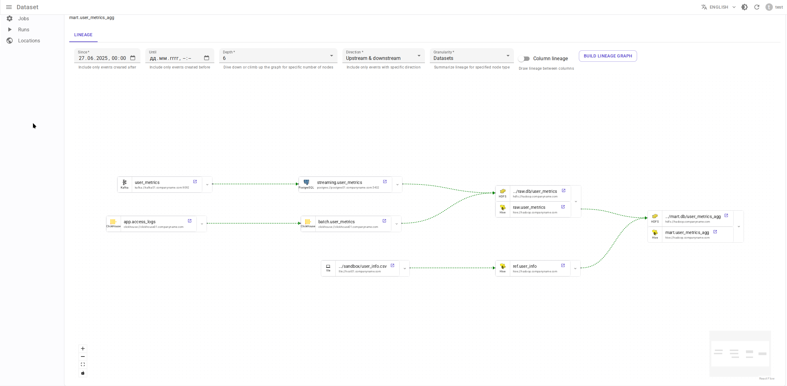
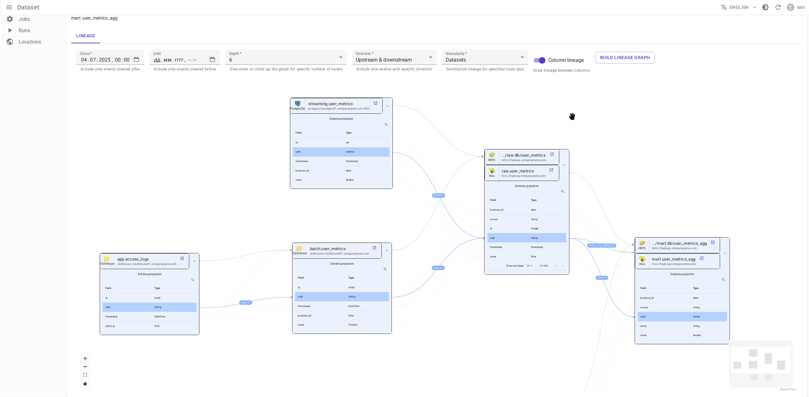
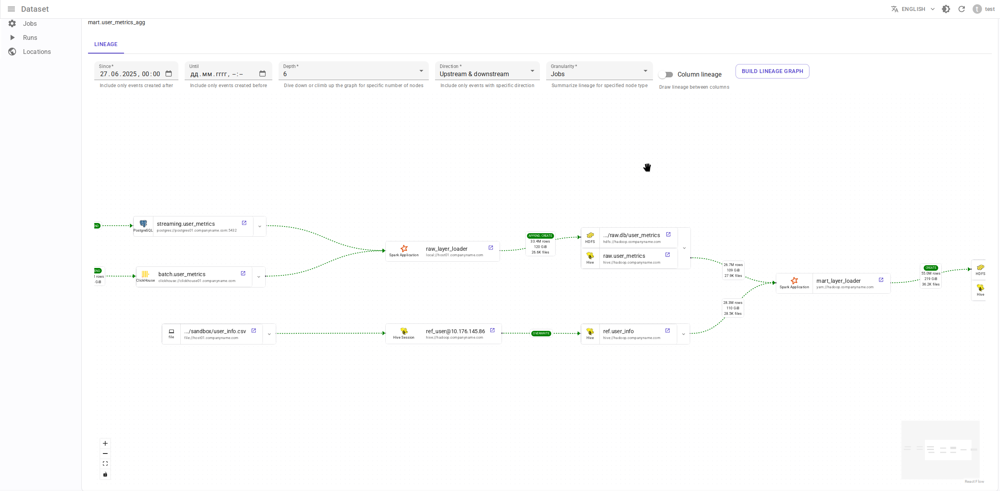

# Data.Rentgen

## Quickstart

[Install][overview-install]
[Entities][entities]

## Integrations

[Apache Spark integration][overview-setup-spark]
[Apache Airflow integration][overview-setup-airflow]
[Apache Flink 1.x integration][overview-setup-flink1]
[Apache Flink 2.x integration][overview-setup-flink2]
[Apache Hive integration][overview-setup-hive]
[DBT integration][overview-setup-dbt]

## Reference

[Architecture][architecture]
[Relation Database][database]
[Message Broker][message-broker]
[Message Consumer][message-consumer]
[Server][server]
[Frontend][frontend]
[HTTP2Kafka proxy][http2kafka]

## Development

[Changelog][changelog]
[Contributing][contributing]
[Security][security]

```{eval-rst}
.. include:: ../README.rst
    :end-before: |Logo|
```

% include raw <svg> instead of <image source=".svg"> to make attribute fill="..." change text color depending on documentation theme

```{raw} html
:file: _static/logo_wide.svg
```

```{eval-rst}
.. include:: ../README.rst
    :start-after: |Logo|
    :end-before: documentation
```

## Screenshots

### Lineage graph

Dataset-level lineage graph



Dataset column-level lineage graph



Job-level lineage graph



Run-level lineage graph

```{image} entities/run_lineage.png
:alt: Job-level lineage graph
```

## Datasets

```{image} entities/dataset_list.png
:alt: Datasets list
```

## Runs

```{image} entities/run_list.png
:alt: Runs list
```

## Spark application

```{image} integrations/spark/job_details.png
:alt: Spark application details
```

## Spark run

```{image} integrations/spark/run_details.png
:alt: Spark run details
```

## Spark command

```{image} integrations/spark/operation_details.png
:alt: Spark command details
```

## Hive query

```{image} integrations/hive/operation_details.png
:alt: Hive query details
```

## Airflow DagRun

```{image} integrations/airflow/dag_run_details.png
:alt: Airflow DagRun details
```

## Airflow TaskInstance

```{image} integrations/airflow/task_run_details.png
:alt: Airflow TaskInstance details
```
