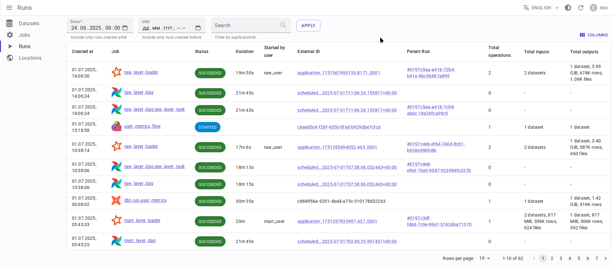
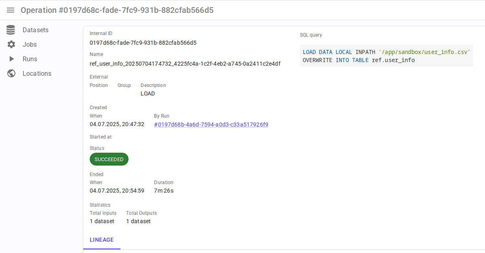

{{ datarentgen_logo_wide }}

     
  

# What is Data.Rentgen?

Data.Rentgen is a Data Motion Lineage service, compatible with [OpenLineage](https://openlineage.io/) specification.

Currently we support consuming lineage from:

* Apache Spark
* Apache Airflow
* Apache Hive
* Apache Flink
* dbt

**Note**: service is under active development, so it doesn’t have stable API for now.

# Goals

* Collect lineage events produced by OpenLineage clients & integrations.
* Store operation-grained events for better detalization (instead of job grained [Marquez](https://marquezproject.ai/)).
* Provide API for fetching both job/run ↔ dataset lineage and dataset ↔ dataset lineage.

# Features

* Support consuming large amounts of lineage events, use Apache Kafka as event buffer.
* Store data in tables partitioned by event timestamp, to speed up lineage graph resolution.
* Lineage graph is build with user-specified time boundaries (unlike Marquez where lineage is build only for last job run).
* Lineage graph can be build with different granularity. e.g. merge all individual Spark commands into Spark applicationId or Spark applicationName.
* Column-level lineage support.
* Authentication support.

# Non-goals

* This is **not** a Data Catalog. DataRentgen doesn’t track dataset schema change, owner and so on. Use [Datahub](https://datahubproject.io/) or [OpenMetadata](https://open-metadata.org/) instead.
* Static Data Lineage like view → table is not supported.

# Limitations

* OpenLineage have integrations with Trino, Debezium and some other lineage sources. DataRentgen support may be added later.
* Unlike Marquez, DataRentgen parses only limited set of facets send by OpenLineage, and doesn’t store custom facets. This can be changed in future.

# Screenshots

## Lineage graph

Dataset-level lineage graph

Dataset column-level lineage graph

Job-level lineage graph

Run-level lineage graph

## Datasets

## Runs

## Spark application

## Spark run

## Spark command

## Hive query

## Airflow DagRun

## Airflow TaskInstance

