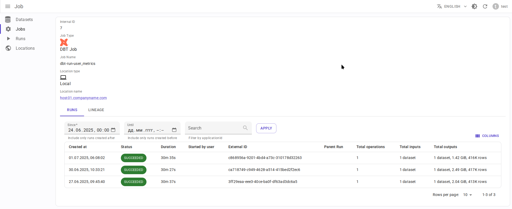
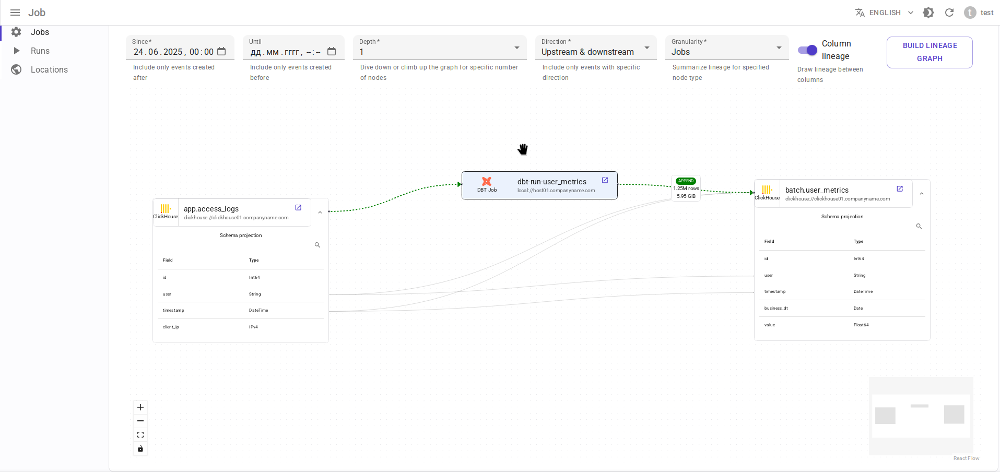
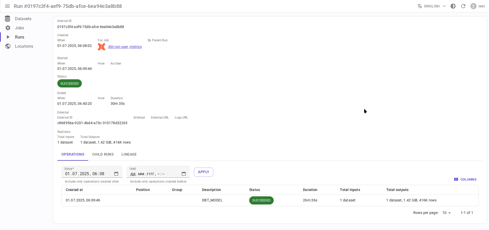

# dbt integration { #overview-setup-dbt }

Using [OpenLineage integration with dbt](https://openlineage.io/docs/integrations/dbt).

## Requirements

- [dbt](https://www.getdbt.com/) 1.3 or higher
- OpenLineage 1.19.0 or higher, recommended 1.34.0+

## Entity mapping

- dbt project → Data.Rentgen Job
- dbt run → Data.Rentgen Run
- dbt model, snapshot, sql, test → Data.Rentgen Operation

## Install

```console
$ pip install "openlineage-dbt>=1.34.0" "openlineage-python[kafka]>=1.34.0" zstd
...
```

## Setup

- Create `openlineage.yml` file with content below\`:

  ```yaml
  transport:
      type: kafka
      topic: input.runs
      config:
          bootstrap.servers: localhost:9093
          security.protocol: SASL_PLAINTEXT
          sasl.mechanism: SCRAM-SHA-256
          sasl.username: data_rentgen
          sasl.password: changeme
          compression.type: zstd
          acks: all
  ```

- Set environment variables:

  ```ini
  OPENLINEAGE_NAMESPACE=local://dbt.host.name
  OPENLINEAGE_CONFIG=/path/to/openlineage.yml
  ```

## Collect and send lineage

Replace `dbt` CLI commands:

```shell
$ dbt run myproject
...
$ dbt test myproject
...
```

with `dbt-ol` CLI:

```shell
$ dbt-ol run myproject
...
$ dbt-ol test myproject
...
```

Lineage will be send to Data.Rentgen automatically by OpenLineage integration.

## See results

Browse frontend page [Jobs](http://localhost:3000/jobs) to see what information was extracted by OpenLineage & DataRentgen

### Job list page


### Job details page



### Job-level lineage



### Run details



### Run lineage


### Operation details


### Operation lineage


