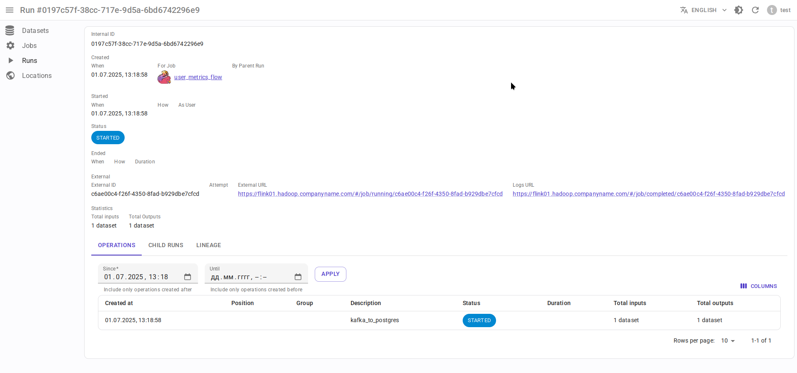

# Apache Flink 2.x integration { #overview-setup-flink2 }

Using [OpenLineage integration with Apache Flink 2.x](https://openlineage.io/docs/integrations/flink/flink2).

## Requirements

- [Apache Flink](https://flink.apache.org/) 2.x
- OpenLineage 1.31.0 or higher, recommended 1.34.0+

## Entity mapping

- Flink job → Data.Rentgen Job
- Flink job run → Data.Rentgen Run + Data.Rentgen Operation

## Installation

- Download these jars and place then in `openlineage/jars/` directory:

  - [openlineage-java](https://mvnrepository.com/artifact/io.openlineage/openlineage-java)
  - [openlineage-flink](https://mvnrepository.com/artifact/io.openlineage/openlineage-flink)
  - [kafka-clients](https://mvnrepository.com/artifact/org.apache.kafka/kafka-clients)
  - [zstd-jni](https://mvnrepository.com/artifact/com.github.luben/zstd-jni)

- Set environment variable `CLASSPATH` of Flink's `JobManager` to point to this directory path:

  ```ini
  CLASSPATH=/path/to/openlineage/jars/
  ```

- Configure Flink `JobManager` to load these dependencies using its own ClassLoader:

  ```yaml title="config.yaml"

  classloader.parent-first-patterns.additional: ["io.openlineage.", "org.apache.kafka.","com.github.luben."]
  ```

  Otherwise Flink will load all classes from job's classloader, and this could lead to errors like:

  ```text
  org.apache.kafka.common.KafkaException: class org.apache.kafka.common.serialization.StringSerializer is not an instance of org.apache.kafka.common.serialization.Serializer
  java.util.ServiceConfigurationError: io.openlineage.client.transports.TransportBuilder: io.openlineage.client.transports.HttpTransportBuilder not a subtype
  ```

  See [Flink documentation](https://nightlies.apache.org/flink/flink-docs-release-2.0/docs/deployment/config/#class-loading) for more details.

## Setup

- Add `OpenLineageJobStatusChangedListenerFactory` to Flink `config.yaml`:

  ```yaml title="config.yaml"

  classloader.parent-first-patterns.additional: ["io.openlineage.", "org.apache.kafka.","com.github.luben."]
  execution.job-status-changed-listeners: io.openlineage.flink.listener.OpenLineageJobStatusChangedListenerFactory  # capture job event
  execution.attached: true  # capture job stop events
  execution.job-listener.openlineage.namespace: http://some.host.name:18081  # set namespace to match Flink address
  execution.job-listener.openlineage.job-name: flink_examples_stateful  # set job name
  ```

- Create `openlineage.yml` file with content like:

  ```yaml title="openlineage.yml"

  # Send RUNNING event every 1 hour.
  # Using default interval (1 minute) just floods Kafka with useless RUNNING events.
  trackingIntervalInSeconds: 600

  transport:
      type: kafka
      topicName: input.runs
      properties:
          bootstrap.servers: broker:9092  # not using localhost in docker
          security.protocol: SASL_PLAINTEXT
          sasl.mechanism: SCRAM-SHA-256
          sasl.jaas.config: |
              org.apache.kafka.common.security.scram.ScramLoginModule required
              username="data_rentgen"
              password="changeme";
          key.serializer: org.apache.kafka.common.serialization.StringSerializer
          value.serializer: org.apache.kafka.common.serialization.StringSerializer
          compression.type: zstd
          acks: all
  ```

- Pass path to config file via `OPENLINEAGE_CONFIG` environment variable of `jobmanager`:

  ```ini
  OPENLINEAGE_CONFIG=/path/to/openlineage.yml
  ```

At the end, this should look like this (see [Official documentation](https://nightlies.apache.org/flink/flink-docs-release-2.0/docs/deployment/resource-providers/standalone/docker/)):

```yaml title="docker-compose.yml"

services:
    jobmanager:
        image: flink:2.0.0-scala_2.12-java11
        ports:
        - "18081:8081"
        # supported both standalone-job and jobmanager
        command: standalone-job --job-classname my.awesome.FlinkStatefulApplication
        volumes:
        - ./artifacts/:/opt/flink/usrlib/  # path to you Flink Job .jar files, if using standalone-job
        - ./config.yaml:/opt/flink/conf/config.yaml
        - ./openlineage/jars/:/opt/flink/usrlib/openlineage/
        - ./openlineage.yml:/opt/flink/conf/openlineage.yml
        environment:
        - CLASSPATH=/opt/flink/usrlib/openlineage/

    taskmanager:
        image: flink:2.0.0-scala_2.12-java11
        depends_on:
        - jobmanager
        command: taskmanager
        volumes:
        - ./artifacts/:/opt/flink/usrlib/  # path to you Flink Job .jar files, if using standalone-job
        - ./config.yaml:/opt/flink/conf/config.yaml
```

## Collect and send lineage

Just start your Flink job. OpenLineage integration will automatically collect and send lineage to DataRentgen.

## See results

Browse frontend pages [Jobs](http://localhost:3000/jobs) to see what information was extracted by OpenLineage & DataRentgen.

### Job list page


### Job details page


### Run details page



### Dataset level lineage


### Job level lineage


### Run level lineage


