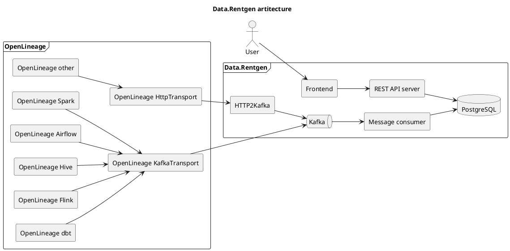

# Architecture { #Architecture }

## Components

Data.Rentgen is build using following components:

- [OpenLineage](https://openlineage.io/docs/) clients & integrations with third-party modules (e.g. Apache Spark, Apache Airflow).
- [`message-broker`](message-broker), receiving events in JSON format.
- [`message-consumer`](message-consumer), parsing JSON messages.
- [`database`](database) for storing consumed & cleaned up data.
- [`server`](server), serving database data.
- [`frontend`](frontend), accessing REST API to navigate created entities & lineage graph.
- [`http2kafka`](http2kafka) (optional), proxy for sending OpenLineage events to Kafka using HTTP API.

## Architecture diagram

