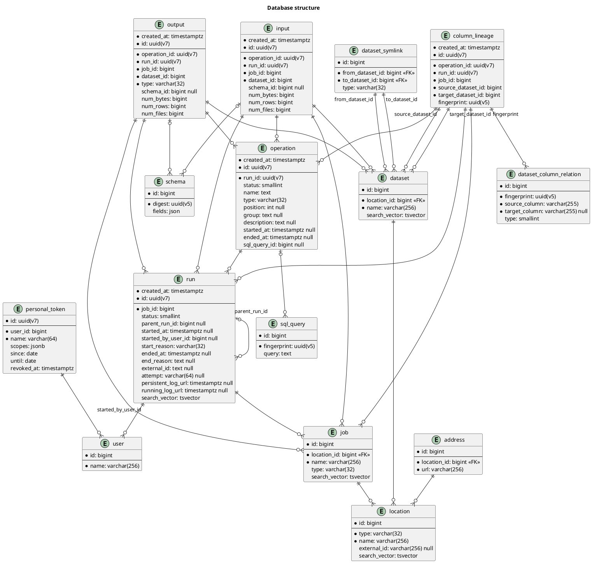
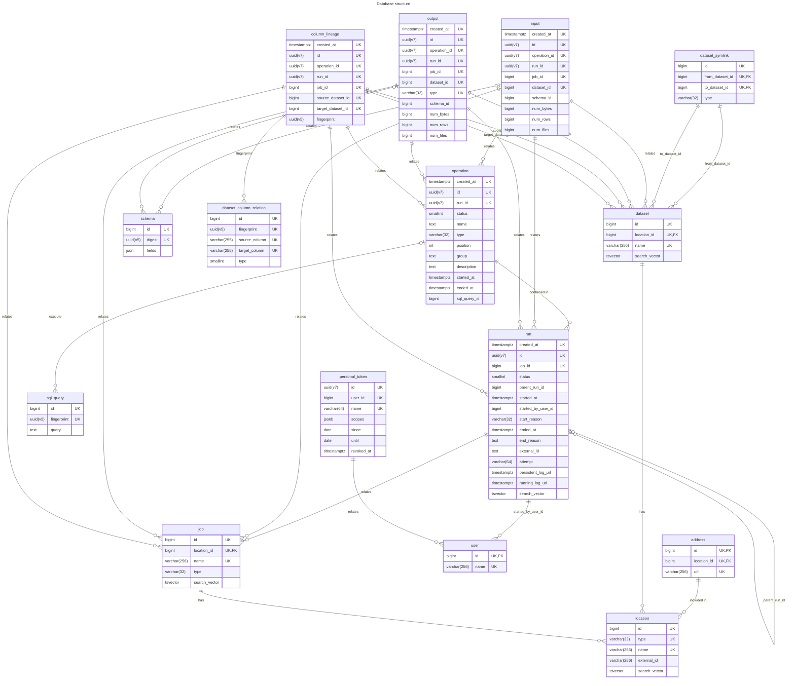

# Database structure { #database-structure }

% https://plantuml.com/en/ie-diagram

```plantuml

    @startuml
    title Database structure

    entity user {
        * id: bigint
        ----
        * name: varchar(256)
    }

    entity address {
        * id: bigint
        ----
        * location_id: bigint <<FK>>
        * url: varchar(256)
    }

    entity location {
        * id: bigint
        ----
        * type: varchar(32)
        * name: varchar(256)
        external_id: varchar(256) null
        search_vector: tsvector
    }

    entity dataset {
        * id: bigint
        ----
        * location_id: bigint <<FK>>
        * name: varchar(256)
        search_vector: tsvector
    }

    entity dataset_symlink {
        * id: bigint
        ----
        * from_dataset_id: bigint <<FK>>
        * to_dataset_id: bigint <<FK>>
        type: varchar(32)
    }

    entity job {
        * id: bigint
        ----
        * location_id: bigint <<FK>>
        * name: varchar(256)
        type: varchar(32)
        search_vector: tsvector
    }

    entity run {
        * created_at: timestamptz
        * id: uuid(v7)
        ----
        * job_id: bigint
        status: smallint
        parent_run_id: bigint null
        started_at: timestamptz null
        started_by_user_id: bigint null
        start_reason: varchar(32)
        ended_at: timestamptz null
        end_reason: text null
        external_id: text null
        attempt: varchar(64) null
        persistent_log_url: timestamptz null
        running_log_url: timestamptz null
        search_vector: tsvector
    }

    entity sql_query {
        * id: bigint
        ----
        * fingerprint: uuid(v5)
        query: text
    }

    entity operation {
        * created_at: timestamptz
        * id: uuid(v7)
        ----
        * run_id: uuid(v7)
        status: smallint
        name: text
        type: varchar(32)
        position: int null
        group: text null
        description: text null
        started_at: timestamptz null
        ended_at: timestamptz null
        sql_query_id: bigint null
    }

    entity schema {
        * id: bigint
        ----
        * digest: uuid(v5)
        fields: json
    }

    entity input {
        * created_at: timestamptz
        * id: uuid(v7)
        ----
        * operation_id: uuid(v7)
        * run_id: uuid(v7)
        * job_id: bigint
        * dataset_id: bigint
        schema_id: bigint null
        num_bytes: bigint
        num_rows: bigint
        num_files: bigint
    }

    entity output {
        * created_at: timestamptz
        * id: uuid(v7)
        ----
        * operation_id: uuid(v7)
        * run_id: uuid(v7)
        * job_id: bigint
        * dataset_id: bigint
        * type: varchar(32)
        schema_id: bigint null
        num_bytes: bigint
        num_rows: bigint
        num_files: bigint
    }

    entity dataset_column_relation {
        * id: bigint
        ----
        * fingerprint: uuid(v5)
        * source_column: varchar(255)
        * target_column: varchar(255) null
        type: smallint
    }

    entity column_lineage {
        * created_at: timestamptz
        * id: uuid(v7)
        ----
        * operation_id: uuid(v7)
        * run_id: uuid(v7)
        * job_id: bigint
        * source_dataset_id: bigint
        * target_dataset_id: bigint
        fingerprint: uuid(v5)
    }

    entity personal_token {
        * id: uuid(v7)
        ----
        * user_id: bigint
        * name: varchar(64)
        scopes: jsonb
        since: date
        until: date
        revoked_at: timestamptz
    }

    address ||--o{ location

    dataset ||--o{ location
    job ||--o{ location

    dataset_symlink "from_dataset_id" ||--o{ dataset
    dataset_symlink "to_dataset_id" ||--o{ dataset

    run ||--o{ job
    run "started_by_user_id" ||--o{ user
    run "parent_run_id" |o--o{ run

    operation ||--o{ run
    operation |o--o{ sql_query

    input ||--o{ operation
    input ||--o{ run
    input ||--o{ job
    input ||--o{ dataset
    input |o--o{ schema

    output ||--o{ operation
    output ||--o{ run
    output ||--o{ job
    output ||--o{ dataset
    output |o--o{ schema

    column_lineage ||--o{ operation
    column_lineage ||--o{ run
    column_lineage ||--o{ job
    column_lineage "source_dataset_id" ||--o{ dataset
    column_lineage "target_dataset_id" ||--o{ dataset
    column_lineage "fingerprint" ||--o{ dataset_column_relation

    personal_token ||--o{ user

    @enduml
```

```mermaid
---
title: Database structure
---

erDiagram

    address {
        bigint id UK, PK
        bigint location_id UK, FK  
        varchar(256) url UK
    }

    location {
        bigint id UK
        varchar(32) type  UK
        varchar(256) name UK 
        varchar(256) external_id
        tsvector search_vector
    }

    user {
        bigint id UK, PK 
        varchar(256) name UK 
    }
   dataset {
        bigint id UK
        bigint location_id  UK, FK
        varchar(256) name UK
        tsvector search_vector
    }

    dataset_symlink {
        bigint id UK
        bigint from_dataset_id  UK, FK
        bigint to_dataset_id  UK, FK
        varchar(32) type
    }

    job {
        bigint id UK
        bigint location_id  UK, FK
        varchar(256) name UK
        varchar(32) type
        tsvector search_vector
    }

    run {
        timestamptz created_at UK
        uuid(v7) id UK
        bigint job_id UK
        smallint status
        bigint parent_run_id
        timestamptz started_at
        bigint started_by_user_id
        varchar(32) start_reason
        timestamptz ended_at
        text end_reason
        text external_id
        varchar(64) attempt
        timestamptz persistent_log_url
        timestamptz running_log_url
        tsvector search_vector
    }

    sql_query {
        bigint id UK
        uuid(v5) fingerprint UK
        text query
    }

    operation {
        timestamptz created_at UK
        uuid(v7) id UK
        uuid(v7) run_id UK
        smallint status
        text name
        varchar(32) type
        int position
        text group
        text description
        timestamptz started_at
        timestamptz ended_at
        bigint sql_query_id
    }

    schema {
        bigint id UK
        uuid(v5) digest UK
        json fields
    }

    input {
        timestamptz created_at UK
        uuid(v7) id UK
        uuid(v7) operation_id UK
        uuid(v7) run_id UK
        bigint job_id UK
        bigint dataset_id UK
        bigint schema_id
        bigint num_bytes
        bigint num_rows
        bigint num_files
    }

    output {
        timestamptz created_at UK
        uuid(v7) id UK
        uuid(v7) operation_id UK
        uuid(v7) run_id UK
        bigint job_id UK
        bigint dataset_id UK
        varchar(32) type UK
        bigint schema_id
        bigint num_bytes
        bigint num_rows
        bigint num_files
    }

    dataset_column_relation {
        bigint id UK
        uuid(v5) fingerprint UK
        varchar(255) source_column UK
        varchar(255) target_column UK
        smallint type
    }

    column_lineage {
        timestamptz created_at UK
        uuid(v7) id UK
        uuid(v7) operation_id UK
        uuid(v7) run_id UK
        bigint job_id UK
        bigint source_dataset_id UK
        bigint target_dataset_id UK
        uuid(v5) fingerprint
    }

    personal_token {
        uuid(v7) id UK
        bigint user_id UK
        varchar(64) name UK
        jsonb scopes
        date since
        date until
        timestamptz revoked_at
    }


    address ||--o{ location: "included in"
    dataset ||--o{ location: has
    job ||--o{ location: has

    dataset_symlink ||--o{ dataset: "from_dataset_id"
    dataset_symlink ||--o{ dataset: "to_dataset_id"

    run ||--o{ job: relates
    run ||--o{ user: "started_by_user_id"
    run |o--o{ run: "parent_run_id"

    operation ||--o{ run: "contained in"
    operation |o--o{ sql_query: "execute"

    input ||--o{ operation: relates
    input ||--o{ run: relates
    input ||--o{ job: relates
    input ||--o{ dataset: relates
    input |o--o{ schema: relates

    output ||--o{ operation: relates
    output ||--o{ run: relates
    output ||--o{ job: relates
    output ||--o{ dataset: relates
    output |o--o{ schema: relates

    column_lineage ||--o{ operation: relates
    column_lineage ||--o{ run: relates
    column_lineage ||--o{ job: relates
    column_lineage ||--o{ dataset: "source_dataset_id"
    column_lineage ||--o{ dataset: "target_dataset_id"
    column_lineage ||--o{ dataset_column_relation: "fingerprint"

    personal_token ||--o{ user: relates
```
