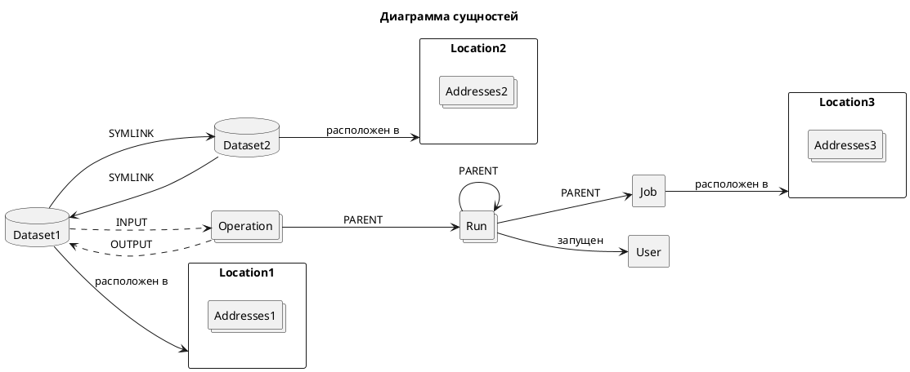
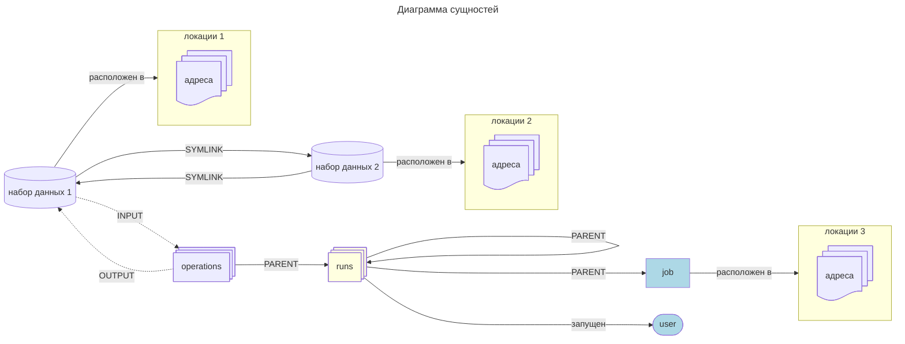

# Сущности { #entities }

## Узлы графа { #nodes }

Узлы — это независимые сущности, которые описывают информацию о некоторой реальной сущности, такой как таблица, ETL-job, запуск ETL-run и т.д.

### Location

Представляет информацию о том, "где расположен датасет", "откуда запущено задание".
Это аналог концепции [OpenLineage namespace](https://openlineage.io/docs/spec/naming/).

Примеры:

- `hive://some-cluster`
- `hdfs://some-cluster`
- `oracle://some.host.name:1521`
- `postgres://some.host.name:5432`
- `yarn://some-cluster`
- `local://some.host.name`
- `http://airflow-web-ui.domain.com:8080`

Содержит следующие поля:

- `id: int` - внутренний уникальный идентификатор.

- `type: str` - тип location, например, `hive`, `hdfs`, `oracle` и т.д.

- `name: str` - имя location, например, `some-cluster`, `some.host.name`

- `external_id: str | None` - внешний идентификатор этого location в какой-либо сторонней системе (например, PlatformInstance в [Datahub](https://datahubproject.io/)).

- `addresses` - список альтернативных адресов location (см. ниже):

  - `url: str` - альтернативный адрес в форме URL.

#### Адреса location

В реальном мире один и тот же физический хост или кластер может иметь несколько адресов, например:

- К экземпляру PostgreSQL можно обратиться по имени хоста `postgres://some.host.name:5432` или по IP `postgres://192.128.20.14:5432`
- С номером порта или без - `postgres://some.host.name:5432` или `postgres://some.host.name`

Также к кластерам, таким как Hadoop, Kafka и т.д., можно обращаться по нескольким именам хостов:

- `hdfs://some-cluster` → `[hdfs://some-cluster.name.node1:8082, hdfs://some-cluster.name.node2]`.
- `kafka://bootstrap.server1,bootstrap.server2,bootstrap.server3` → `[kafka://bootstrap.server1,kafka://bootstrap.server2,kafka://bootstrap.server3]`.

Каждый экземпляр приложения Spark может подключаться к любому из этих адресов и обращаться к одним и тем же данным.

Наличие списка альтернативных адресов конкретного location позволяет разрешить эту неоднозначность и всегда связывать одну и ту же физическую таблицу на одном и том же кластере с одним и тем же датасетом Data.Rentgen. Это предотвращает создание дубликатов набора данных или задания.

### Набор данных (dataset) { #dataset }

Представляет информацию о некоторой таблице/топике/коллекции/папке, хранящейся в определённом location.

Примеры:

- `hive://some-cluster` + `myschema.mytable` - таблица внутри кластера Hive.
- `postgres://some.host.name:5432` + `mydb.myschema.mytable` - таблица внутри экземпляра Postgres.
- `hdfs://some-cluster` + `/app/warehouse/hive/managed/myschema.db/mytable` - папка внутри кластера HDFS.

Обратите внимание, что вся информация, которой обладает Data.Rentgen, фактически предоставлена ETL-процессами, а не базой данных. Интеграций с базами данных нет.

Например, команда Spark читает что-то из объекта PostgreSQL `public.dataset_name`. Это может быть таблица, представление, внешняя таблица - *мы не знаем*.

Вот почему информация о наборах данных очень ограничена:

- `id: int` - внутренний уникальный идентификатор.
- `location: Location` - location, где фактически хранятся данные, например, экземпляр RDMBS или кластер.
- `name: str` - квалифицированное имя набора данных, например, `mydb.myschema.mytable` или `/app/warehouse/hive/managed/myschema.df/mytable`
- `schema: Schema | None` - схема набора данных.

#### Схема набора данных

Схема существует только как часть некоторого взаимодействия, например, приложение Spark записало некоторый dataframe в ORC-файл,
или Flink получил некоторые данные из таблицы PostgreSQL.

Может быть несколько схем набора данных:

- Если набор данных является входным, он может содержать только *выбранные* столбцы. Мы называем это проекцией схемы.
- Если набор данных является выходным, поле схемы обычно представляет фактические столбцы таблицы. За исключением столбцов `DEFAULT` или `COMPUTED`.
- Если набор данных является и входным, и выходным, мы предпочитаем использовать выходную схему, потому что она содержит больше информации (например, типы столбцов).

Схема набора данных содержит следующие поля:

- `id: int` - внутренний уникальный идентификатор.

- `fields: list[SchemaField]`:

  - `name: str` - имя столбца
  - `type: str | None` - тип столбца, если есть.
    Обратите внимание, что это типы в ETL-движке (Spark, Flink и т.д.), а не типы источника (Postgres, Clickhouse).
  - `description: str | None` - описание/комментарий к столбцу, если есть.
  - `fields: list[SchemaField]` - если столбец содержит вложенные поля (например, `struct`, `array`, `map`).

- `relevance_type: Enum` - описывает, актуальна ли эта информация о схеме:

  - `EXACT_MATCH` - возвращается, если все взаимодействия с этим набором данных использовали только одну схему.
  - `LATEST_KNOWN` - если есть несколько взаимодействий с этим набором данных, но с разными схемами. В этом случае возвращается схема самого последнего взаимодействия.

### Job

Представляет информацию об ETL-job в определённом location.
Это абстракция для группировки различных запусков одного и того же приложения Spark, Airflow DAG, Airflow Task и т.д.

Примеры:

- `yarn://some-cluster` + `my-spark-session` - имя приложения Spark, запущенного внутри кластера YARN (`master=yarn`).
- `local://some.host.name` + `my-spark-session` - имя приложения Spark, запущенного на хосте (`master=local`).
- `http://airflow-web-ui.domain.com:8080` + `my_dag` - Airflow DAG, созданный в экземпляре Airflow.
- `http://airflow-web-ui.domain.com:8080` + `my_dag.mytask` - Airflow Task в рамках Airflow DAG, созданный в экземпляре Airflow.
- `http://flink.domain.com:18081` + `some_flink_application` - задание Flink, запущенное в экземпляре Flink.
- `local://some.host.name` + `my_project` - проект dbt, запущенный на хосте.

Содержит следующие поля:

- `id: int` - внутренний уникальный идентификатор.

- `location: Location` - location, где запускается job, например, кластер или имя хоста.

- `name: str` - имя job, например, `my-session-name`, `mydag`, `mydag.mytask`

- `type: str` - тип job, например:

  - `SPARK_APPLICATION`
  - `AIRLOW_DAG`
  - `AIRFLOW_TASK`
  - `FLINK_JOB`
  - `DBT_JOB`
  - `UNKNOWN`

### Пользователь (User)

Представляет информацию о пользователе.

Содержит следующие поля:

- `id: bigint` - внутренний уникальный идентификатор.
- `name: str` - имя пользователя.

### Запуск (Run)

Представляет информацию о запуске задания:

- для Spark это Spark applicationId
- для Airflow DAG это DagRun
- для Airflow Task это TaskInstance
- для Apache Flink это jobId
- для dbt это экземпляр `dbt run`

Содержит следующие поля:

- `id: uuidv7` - уникальный идентификатор, сгенерированный на клиенте.

- `created_at: timestamp` - извлеченная временная метка UUIDv7, используемая для целей фильтрации.

- `job_id: int` - связывает с конкретным job.

- `parent_run_id: uuidv7` - родительский запуск, который инициировал этот конкретный запуск, например, идентификатор приложения Spark был запущен экземпляром задачи Airflow, или экземпляр задачи Airflow является дочерним по отношению к Airflow DagRun.

- `started_at: timestamp | None` - временная метка, когда было получено событие OpenLineage с `eventType=START`.

- `started_by user: User | None` - пользователь ОС/принципал Kerberos, от имени которого была запущена сессия Spark.

- `start_reason: Enum | None` - "почему этот запуск был начат?":

  - `MANUAL`
  - `AUTOMATIC` - например, по расписанию или запущен другим запуском.

- `status: Enum` - статус запуска. В настоящее время поддерживаются следующие статусы:

  - `UNKNOWN`
  - `STARTED`
  - `SUCCEEDED`
  - `FAILED`
  - `KILLED`

- `ended_at: timestamp | None` - временная метка, когда было получено событие OpenLineage с `eventType=COMPLETE|FAIL|ABORT`.

- `ended_reason: str | None` - причина получения этого статуса, если это `FAILED` или `KILLED`.

- `external_id : str | None` - внешний идентификатор этого запуска, например, Spark `applicationId` или Airflow `dag_run_id`.

- `attempt: str | None` - внешний номер попытки этого запуска, например, Spark `attemptId` в YARN или Airflow Task `try_number`.

- `running_log_url: str | None` - внешний URL, где можно найти информацию о конкретном запуске (например, Spark UI).

- `persistent_log_url: str | None` - внешний URL, где можно найти логи конкретного запуска (например, Spark History server, Airflow Web UI).

### Операция (Operation)

Представляет информацию о конкретной задаче Spark или выполнении Spark. На данный момент Airflow DAG и задача Airflow не имеют никаких операций.

Содержит следующие поля:

- `id: uuidv7` - уникальный идентификатор, сгенерированный на клиенте.

- `created_at: timestamp` - извлеченная временная метка UUIDv7, используемая для целей фильтрации.

- `run_id: uuidv7` - связан с конкретным запуском.

- `started_at: timestamp | None` - временная метка, когда было получено событие OpenLineage с `eventType=START`.

- `status: Enum` - статус запуска. В настоящее время поддерживаются следующие статусы:

  - `UNKNOWN`
  - `STARTED`
  - `SUCCEEDED`
  - `FAILED`
  - `KILLED`

- `ended_at: timestamp | None` - временная метка, когда было получено событие OpenLineage с `eventType=COMPLETE|FAIL|ABORT`.

- `name: str` - имя операции, например, команда Spark, имя команды dbt.

- `position: int | None` - позиционный номер операции, например, номер выполнения Spark в Spark UI или `map_index` задачи Airflow.

- `group: str | None` - поле для группировки операций, например, `jobGroup` задачи Spark или тип команды DBT (`MODEL`, `SQL`, `TEST`, `SNAPSHOT`).

- `description: str | None` - описание операции, например, поле `jobDescription` задачи Spark, имя оператора Airflow.

- `sql_query: str | None` - SQL-запрос, выполненный этой операцией, если таковой имеется.

## Отношения (Relations)

Эти сущности описывают отношения между различными узлами.

### Dataset Symlink (Символическая ссылка набора данных)

Представляет отношения набора даных, такие как `Таблица метаданных Hive → Расположение таблицы в HDFS/S3` и наоборот.

Содержит следующие поля:

- `from: Dataset` - начальная точка символической ссылки.

- `to: Dataset` - конечная точка символической ссылки.

- `type: Enum` - тип символической ссылки. поддерживаются следующие типы:

  - `METASTORE` - от location HDFS к таблице Hive в metastore.
  - `WAREHOUSE` - от таблицы Hive к местоположению HDFS/S3.

!!! note "Примечание"

  В настоящее время OpenLineage отправляет только символические ссылки `location HDFS → Таблица Hive`, которые [не существуют в реальном мире](https://github.com/OpenLineage/OpenLineage/issues/2718#issuecomment-2134746258).
  Консьюмер сообщений автоматически добавляет обратную символическую ссылку `Таблица Hive → location HDFS` для упрощения построения графа lineage, но это временное решение.

### Parent Relation (Связь с родителем)

Отношение между дочерним запуском/операцией и его родителем. Например:

- Spark applicationName является родителем для всех его запусков (applicationId).
- Spark applicationId является родителем для всех его задач Spark или выполнений Spark.
- Airflow DAG является родителем задачи Airflow.
- Экземпляр задачи Airflow запустил Spark applicationId, dbt run и т.д.

Содержит следующие поля:

- `from: Job | Run` - родительская сущность.
- `to: Run | Operation` - дочерняя сущность.

### Input relation

Отношение Dataset → Operation, описывающее процесс чтения некоторых данных из определенной таблицы/папки конкретной операцией.

Также возможно агрегировать все входы конкретного Dataset → Run, Dataset → Job или Dataset -> Dataset, настраивая опцию взаимодействия `granularity` графа lineage

Содержит следующие поля:

- `from: Dataset` - источник данных.
- `to: Operation | Run | Job | Dataset` - назначение данных.
- `num_rows: int | None` - количество строк, прочитанных из набора данных. Для `granularity=JOB|RUN` это сумма всех прочитанных строк из этого набора данных. Для `granularity=DATASET` всегда `None`.
- `num_bytes: int | None` - количество байт, прочитанных из набора данных. Для `granularity=JOB|RUN` это сумма всех прочитанных байт из этого набора данных. Для `granularity=DATASET` всегда `None`.
- `num_files: int | None` - количество файлов, прочитанных из набора данных. Для `granularity=JOB|RUN` это сумма всех прочитанных файлов из этого набора данных. Для `granularity=DATASET` всегда `None`.

### Output relation (Отношение вывода)

Отношение Operation → Dataset, описывающее процесс записи некоторых данных в определенную таблицу/папку конкретной командой Spark или изменения метаданных таблицы/папки.

Также возможно агрегировать все выходы конкретной комбинации Run → Dataset или Job → Dataset, настраивая опцию `granularity` графа lineage

Содержит следующие поля:

- `from: Operation | Run | Job` - источник вывода.

- `to: Dataset` - назначение вывода.

- `types: list[Enum]` - тип вывода. поддерживаются следующие типы:

  - `CREATE`
  - `ALTER`
  - `RENAME`
  - `APPEND`
  - `OVERWRITE`
  - `DROP`
  - `TRUNCATE`

  Для `granularity=JOB|RUN` это комбинация всех типов вывода для этого набора данных.

- `num_rows: int | None` - количество строк, записанных из набора данных. Для `granularity=JOB|RUN` это сумма всех записанных строк в этот набор данных.

- `num_bytes: int | None` - количество байт, записанных из набора данных. Для `granularity=JOB|RUN` это сумма всех записанных байт в этот набор данных.

- `num_files: int | None` - количество файлов, записанных из набора данных. Для `granularity=JOB|RUN` это сумма всех записанных файлов в этот набор данных.

### Direct Column Lineage relation (Прямая связь колонок)

Отношение столбцов Dataset → столбцов Dataset, описывающее, как каждый столбец целевого набора данных связан с некоторыми столбцами исходного набора данных.

- `from: Dataset` - исходный набор данных.

- `to: Dataset` - целевой набор данных.

- `fields: dict[str, list[SourceColumn]]` - сопоставление между именами исходных и целевых столбцов, где `SourceColumn` это:

  - `field: str` - имя исходного столбца

  - `types: list[Enum]` - типы преобразования, применяемые к исходному столбцу. Поддерживаемые типы:

    - `IDENTITY` - столбец используется как есть, например, `SELECT source_column AS target_column`
    - `TRANSFORMATION` - к значению столбца применяется некоторая функция без маскирования, например, `SELECT source_column || '_suffix' AS target_column`
    - `TRANSFORMATION_MASKING` - к значению столбца применяется некоторая функция маскирования, например, `SELECT hash(source_column) AS target_column`
    - `AGGREGATION` - к значению столбца применяется некоторая функция агрегации без маскирования, например, `SELECT max(source_column) AS target_column`
    - `AGGREGATION_MASKING` - к значению столбца применяется некоторая функция агрегации с маскированием, например, `SELECT count(DISTINCT source_column) AS target_column`
    - `UNKNOWN` - некоторый неизвестный тип преобразования.

### Indirect Column Lineage relation (косвенные связи столбцов)

Отношение столбцов Dataset → Dataset, описывающее, как весь целевой набор данных связан с некоторыми столбцами исходного набора данных.

- `from: Dataset` - исходный набор данных.

- `to: Dataset` - целевой набор данных.

- `fields: list[Column]` - список исходных столбцов, где `SourceColumn` это:

  - `field: str` - имя исходного столбца

  - `types: list[Enum]` - типы преобразования, применяемые к исходному столбцу. Поддерживаемые типы:

    - `FILTER` - столбец используется в предложении `WHERE`, например, `SELECT * WHERE source_column = 'abc'`
    - `JOIN` - столбец используется в предложении JOIN, например, `SELECT * FROM source_dataset1 JOIN source_dataset2 ON source_dataset1.id = source_dataset2.id`
    - `GROUP_BY` - столбец используется в предложении `GROUP BY`, например, `SELECT source_column, count(*) FROM source_dataset GROUP BY source_column`
    - `SORT` - столбец используется в предложении `ORDER BY`, например, `SELECT * FROM source_dataset ORDER BY source_column`
    - `WINDOW` - столбец используется в предложении `WINDOW`, например, `SELECT max(*) OVER (source_column) AS target_column`
    - `CONDITIONAL` - столбец используется в предложении `CASE` или `IF`, например, `SELECT CASE source_column THEN 1 WHEN 'abc' ELSE 'cde' END AS target_column`
    - `UNKNOWN` - некоторый неизвестный тип преобразования.

