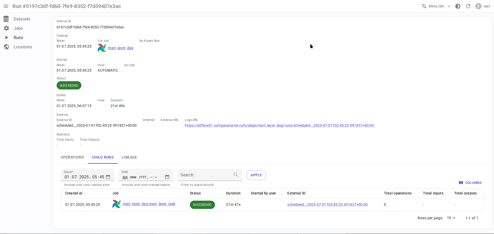

# Сущности { #entities }

## Узлы

Узлы - это независимые сущности, которые описывают информацию о некоторых реальных объектах, таких как таблица, ETL-job,  ETL-run и так далее.

### Location (Местоположение)

Представляет информацию "где находится набор данных", "откуда запущено задание".
Это аналог концепции [OpenLineage namespace](https://openlineage.io/docs/spec/naming/).

Примеры:

- `hive://some-cluster`
- `hdfs://some-cluster`
- `oracle://some.host.name:1521`
- `postgres://some.host.name:5432`
- `yarn://some-cluster`
- `local://some.host.name`
- `http://airflow-web-ui.domain.com:8080`

Содержит следующие поля:

- `id: int` - внутренний уникальный идентификатор.

- `type: str` - тип местоположения, например, `hive`, `hdfs`, `oracle` и так далее.

- `name: str` - имя местоположения, например, `some-cluster`, `some.host.name`

- `external_id: str | None` - внешний идентификатор этого местоположения в какой-либо сторонней системе (например, PlatformInstance в [Datahub](https://datahubproject.io/)).

- `addresses` - список альтернативных адресов местоположения (см. ниже):

  - `url: str` - альтернативный адрес в формате URL.

#### Адреса местоположений

В реальном мире один и тот же физический хост или кластер может иметь несколько адресов, например:

- К экземпляру PostgreSQL можно обратиться по имени хоста `postgres://some.host.name:5432` или по IP `postgres://192.128.20.14:5432`
- С номером порта или без - `postgres://some.host.name:5432` vs. `postgres://some.host.name`

Также к кластерам, таким как Hadoop, Kafka и т.д., можно обращаться по нескольким именам хостов:

- `hdfs://some-cluster` → `[hdfs://some-cluster.name.node1:8082, hdfs://some-cluster.name.node2]`.
- `kafka://bootstrap.server1,bootstrap.server2,bootstrap.server3` → `[kafka://bootstrap.server1,kafka://bootstrap.server2,kafka://bootstrap.server3]`.

Каждое приложение Spark может подключаться к любому из этих адресов и получать доступ к одним и тем же данным.

Наличие списка альтернативных адресов конкретного местоположения позволяет устранить эту неоднозначность и всегда сопоставлять одну и ту же физическую таблицу на одном и том же кластере
с одним и тем же набором данных Data.Rentgen. Это предотвращает создание дубликатов наборов данных или заданий.

### Dataset (Набор данных)

Представляет информацию о некоторой таблице/топике/коллекции/папке, хранящейся в определенном местоположении.

Примеры:

- `hive://some-cluster` + `myschema.mytable` - таблица внутри кластера Hive.
- `postgres://some.host.name:5432` + `mydb.myschema.mytable` - таблица внутри экземпляра Postgres.
- `hdfs://some-cluster` + `/app/warehouse/hive/managed/myschema.db/mytable` - папка внутри кластера HDFS.

Обратите внимание, что вся информация, которой располагает Data.Rentgen, была фактически предоставлена ETL-заданиеми, а не базой данных. Интеграций с базами данных нет.

Например, команда Spark читает что-то из объекта PostgreSQL `public.dataset_name`. Это может быть таблица, представление, внешняя таблица - *мы не знаем*.

Вот почему информация о наборах данных очень ограничена:

- `id: int` - внутренний уникальный идентификатор.
- `location: Location` - Местоположение, где фактически хранятся данные, например, экземпляр RDMBS или кластер.
- `name: str` - квалифицированное имя набора данных, например, `mydb.myschema.mytable` или `/app/warehouse/hive/managed/myschema.df/mytable`
- `schema: Schema | None` - схема набора данных.

#### Схема набора данных

Схема существует только как часть некоторого взаимодействия, например, приложение Spark записало какой-то DataFrame в ORC-файл,
или Flink извлек данные из таблицы PostgreSQL.

Также у набора данных может быть несколько схем:

- Если набор данных является входным, он может содержать только *выбранные* столбцы. Мы называем это проекцией схемы.
- Если набор данных является выходным, поле схемы обычно представляет фактические столбцы таблицы. За исключением столбцов `DEFAULT` или `COMPUTED`.
- Если набор данных является одновременно входным и выходным, мы предпочитаем использовать выходную схему, поскольку она содержит больше информации (например, типы столбцов).

Она содержит следующие поля:

- `id: int` - внутренний уникальный идентификатор.

- `fields: list[SchemaField]`:

  - `name: str` - имя столбца
  - `type: str | None` - тип столбца, если есть.
    Обратите внимание, что это типы в ETL-движке (Spark, Flink и т.д.), а не типы источника (Postgres, Clickhouse).
  - `description: str | None` - описание/комментарий столбца, если есть.
  - `fields: list[SchemaField]` - если столбец содержит вложенные поля (например, `struct`, `array`, `map`).

- `relevance_type: Enum` - описывает, насколько эта информация о схеме актуальна:

  - `EXACT_MATCH` - возвращается, если все взаимодействия с этим набором данных использовали только одну схему.
  - `LATEST_KNOWN` - если есть несколько взаимодействий с этим набором данных, но с разными схемами. В этом случае возвращается схема самого последнего взаимодействия.

### Job (задание)

Представляет информацию об ETL-задании в определенном местоположении.
Это абстракция для группировки различных запусков одного и того же приложения Spark, Airflow DAG, задачи Airflow и т.д.

Примеры:

- `yarn://some-cluster` + `my-spark-session` - имя приложения Spark (applicationName), работающего внутри кластера YARN (`master=yarn`).
- `local://some.host.name` + `my-spark-session` - имя приложения Spark, работающего на хосте (`master=local`).
- `http://airflow-web-ui.domain.com:8080` + `my_dag` - DAG Airflow, созданный в экземпляре Airflow.
- `http://airflow-web-ui.domain.com:8080` + `my_dag.mytask` - задание Airflow в DAG Airflow, созданная в экземпляре Airflow.
- `http://flink.domain.com:18081` + `some_flink_application` - задание Flink, работающая в экземпляре Flink.
- `local://some.host.name` + `my_project` - проект dbt, работающий на хосте.

Содержит следующие поля:

- `id: int` - внутренний уникальный идентификатор.

- `location: Location` - Местоположение, где выполняется задание, например, кластер или имя хоста.

- `name: str` - имя задания, например, `my-session-name`, `mydag`, `mydag.mytask`

- `type: str` - тип задания, например:

  - `SPARK_APPLICATION`
  - `AIRLOW_DAG`
  - `AIRFLOW_TASK`
  - `FLINK_JOB`
  - `DBT_JOB`
  - `UNKNOWN`

### User (Пользователь)

Представляет информацию о некотором пользователе.

Содержит следующие поля:

- `id: bigint` - внутренний уникальный идентификатор.
- `name: str` - имя пользователя.

### Run (Запуск)

Представляет информацию о запуске задания (Job):

- для имени приложения Spark (applicationName) это идентификатор приложения Spark (applicationId)
- для DAG Airflow это DagRun
- для задачи Airflow это TaskInstance
- для Apache Flink это jobId
- для dbt это экземпляр `dbt run`

Содержит следующие поля:

- `id: uuidv7` - уникальный идентификатор, сгенерированный на клиенте.

- `created_at: timestamp` - извлеченная временная метка UUIDv7, используемая для фильтрации.

- `job_id: int` - привязка к конкретному заданию.

- `parent_run_id: uuidv7` - родительский запуск, который инициировал данный конкретный запуск, например, идентификатор приложения Spark был запущен экземпляром задачи Airflow, или экземпляр задачи Airflow является дочерним по отношению к Airflow DagRun.

- `started_at: timestamp | None` - временная метка, когда было получено событие OpenLineage с `eventType=START`.

- `started_by user: User | None` - сессия Spark запущена как конкретный пользователь ОС/принципал Kerberos.

- `start_reason: Enum | None` - "почему был запущен этот запуск?":

  - `MANUAL`
  - `AUTOMATIC` - например, по расписанию или запущен другим запуском.

- `status: Enum` - статус запуска. В настоящее время поддерживаются следующие статусы:

  - `UNKNOWN`
  - `STARTED`
  - `SUCCEEDED`
  - `FAILED`
  - `KILLED`

- `ended_at: timestamp | None` - временная метка, когда было получено событие OpenLineage с `eventType=COMPLETE|FAIL|ABORT`.

- `ended_reason: str | None` - причина получения этого статуса, если это `FAILED` или `KILLED`.

- `external_id : str | None` - внешний идентификатор этого запуска, например, Spark `applicationId` или Airflow `dag_run_id`.

- `attempt: str | None` - внешний номер попытки этого запуска, например, Spark `attemptId` в YARN или Airflow Task `try_number`.

- `running_log_url: str | None` - внешний URL, где можно найти информацию о конкретном запуске (например, Spark UI).

- `persistent_log_url: str | None` - внешний URL, где можно найти логи конкретного запуска (например, сервер истории Spark, веб-интерфейс Airflow).

### Operation (Операция)

Представляет конкретную информацию о задании Spark или выполнении Spark. В настоящее время DAG Airflow и задание Airflow не имеют никаких операций.

Содержит следующие поля:

- `id: uuidv7` - уникальный идентификатор, сгенерированный на клиенте.

- `created_at: timestamp` - извлеченная временная метка UUIDv7, используемая для фильтрации.

- `run_id: uuidv7` - привязка к конкретному запуску.

- `started_at: timestamp | None` - временная метка, когда было получено событие OpenLineage с `eventType=START`.

- `status: Enum` - статус запуска. В настоящее время поддерживаются следующие статусы:

  - `UNKNOWN`
  - `STARTED`
  - `SUCCEEDED`
  - `FAILED`
  - `KILLED`

- `ended_at: timestamp | None` - временная метка, когда было получено событие OpenLineage с `eventType=COMPLETE|FAIL|ABORT`.

- `name: str` - имя операции, например, команда Spark, имя команды dbt.

- `position: int | None` - позиционный номер операции, например, номер выполнения Spark в Spark UI или `map_index` задачи Airflow.

- `group: str | None` - поле для группировки операций, например, `jobGroup` Spark job или тип команды DBT (`MODEL`, `SQL`, `TEST`, `SNAPSHOT`).

- `description: str | None` - описание операции, например, поле `jobDescription` Spark Job, имя оператора Airflow.

- `sql_query: str | None` - SQL-запрос, выполненный этой операцией, если таковой имеется.

## Отношения

Эти сущности описывают отношения между различными узлами.

### Dataset Symlink (Символическая ссылка набора данных)

Представляет отношения наборов данных, такие как `Таблица в метасторе Hive → расположение таблицы в HDFS/S3` и наоборот.

Содержит следующие поля:

- `from: Dataset` - начальная точка символической ссылки.

- `to: Dataset` - конечная точка символической ссылки.

- `type: Enum` - тип символической ссылки. Поддерживаются следующие типы:

  - `METASTORE` - от расположения HDFS к таблице Hive в метасторе.
  - `WAREHOUSE` - от таблицы Hive к расположению HDFS/S3.

!!! note

  В настоящее время OpenLineage отправляет только символические ссылки `Расположение HDFS → таблица Hive`, которые [не существуют в реальном мире](https://github.com/OpenLineage/OpenLineage/issues/2718#issuecomment-2134746258).
  Обработчик сообщений автоматически добавляет обратную символическую ссылку `Таблица Hive → расположение HDFS` для упрощения построения графа родословной, но это временное решение.

### Parent Relation (Родительское отношение)

Отношение между дочерним запуском/операцией и его родителем. Например:

- Имя приложения Spark является родителем для всех его запусков (applicationId).
- Идентификатор приложения Spark является родителем для всех его Job или Run.
- DAG Airflow является родителем задачи Airflow.
- Экземпляр задачи Airflow запустил идентификатор приложения Spark, dbt Run и так далее.

Содержит следующие поля:

- `from: Job | Run` - родительская сущность.
- `to: Run | Operation` - дочерняя сущность.

### Input relation (Отношение ввода)

Отношение Dataset → Operation, описывающее процесс чтения некоторых данных из определенной таблицы/папки конкретной операцией.

Также возможно агрегировать все входы конкретной комбинации Dataset → Run, Dataset → Job или Dataset -> Dataset, настраивая опцию `granularity` (гранулярность) графа родословной.

Содержит следующие поля:

- `from: Dataset` - источник данных.
- `to: Operation | Run | Job | Dataset` - назначение данных.
- `num_rows: int | None` - количество строк, прочитанных из набора данных. Для `granularity=JOB|RUN` это сумма всех прочитанных строк из этого набора данных. Для `granularity=DATASET` всегда `None`.
- `num_bytes: int | None` - количество байт, прочитанных из набора данных. Для `granularity=JOB|RUN` это сумма всех прочитанных байт из этого набора данных. Для `granularity=DATASET` всегда `None`.
- `num_files: int | None` - количество файлов, прочитанных из набора данных. Для `granularity=JOB|RUN` это сумма всех прочитанных файлов из этого набора данных. Для `granularity=DATASET` всегда `None`.

### Output relation (Отношение вывода)

Отношение Operation → Dataset, описывающее процесс записи некоторых данных в определенную таблицу/папку конкретной командой Spark или изменения метаданных таблицы/папки.

Также возможно агрегировать все выводы конкретной комбинации Run → Dataset или Job → Dataset, настраивая опцию `granularity` графа родословной.

Содержит следующие поля:

- `from: Operation | Run | Job` - источник вывода.

- `to: Dataset` - цель вывода.

- `types: list[Enum]` - тип вывода. Поддерживаются следующие типы:

  - `CREATE`
  - `ALTER`
  - `RENAME`
  - `APPEND`
  - `OVERWRITE`
  - `DROP`
  - `TRUNCATE`

  Для `granularity=JOB|RUN` это комбинация всех типов вывода для этого набора данных.

- `num_rows: int | None` - количество строк, записанных из набора данных. Для `granularity=JOB|RUN` это сумма всех записанных строк в этот набор данных.

- `num_bytes: int | None` - количество байт, записанных из набора данных. Для `granularity=JOB|RUN` это сумма всех записанных байт в этот набор данных.

- `num_files: int | None` - количество файлов, записанных из набора данных. Для `granularity=JOB|RUN` это сумма всех записанных файлов в этот набор данных.

### Direct Column Lineage relation (Отношение прямого lineage столбцов)

Отношение столбцов набора данных → столбцы набора данных, описывающее, как каждый целевой столбец набора данных связан с некоторыми исходными столбцами набора данных.

- `from: Dataset` - исходный набор данных.

- `to: Dataset` - целевой набор данных.

- `fields: dict[str, list[SourceColumn]]` - соответствие между именем целевого столбца и исходными столбцами, где `SourceColumn` - это:

  - `field: str` - имя исходного столбца

  - `types: list[Enum]` - типы преобразования, примененные к исходному столбцу. Поддерживаемые типы:

    - `IDENTITY` - столбец используется как есть, например, `SELECT source_column AS target_column`
    - `TRANSFORMATION` - к значению столбца применяется некоторая функция без маскирования, например, `SELECT source_column || '_suffix' AS target_column`
    - `TRANSFORMATION_MASKING` - к значению столбца применяется некоторая функция маскирования, например, `SELECT hash(source_column) AS target_column`
    - `AGGREGATION` - к значению столбца применяется некоторая функция агрегации без маскирования, например, `SELECT max(source_column) AS target_column`
    - `AGGREGATION_MASKING` - к значению столбца применяется некоторая функция агрегации с маскированием, например, `SELECT count(DISTINCT source_column) AS target_column`
    - `UNKNOWN` - какой-то неизвестный тип преобразования.

### Indirect Column Lineage relation (Отношение косвенного lineage столбцов)

Отношение столбцов набора данных → набор данных, описывающее, как весь целевой набор данных связан с некоторыми исходными столбцами набора данных.

- `from: Dataset` - исходный набор данных.

- `to: Dataset` - целевой набор данных.

- `fields: list[Column]` - список исходных столбцов, где `SourceColumn` - это:

  - `field: str` - имя исходного столбца

  - `types: list[Enum]` - типы преобразования, примененные к исходному столбцу. Поддерживаемые типы:

    - `FILTER` - столбец используется в условии `WHERE`, например, `SELECT * WHERE source_column = 'abc'`
    - `JOIN` - столбец используется в условии JOIN, например, `SELECT * FROM source_dataset1 JOIN source_dataset2 ON source_dataset1.id = source_dataset2.id`
    - `GROUP_BY` - столбец используется в условии `GROUP BY`, например, `SELECT source_column, count(*) FROM source_dataset GROUP BY source_column`
    - `SORT` - столбец используется в условии `ORDER BY`, например, `SELECT * FROM source_dataset ORDER BY source_column`
    - `WINDOW` - столбец используется в условии `WINDOW`, например, `SELECT max(*) OVER (source_column) AS target_column`
    - `CONDITIONAL` - столбец используется в условии `CASE` или `IF`, например, `SELECT CASE source_column THEN 1 WHEN 'abc' ELSE 'cde' END AS target_column`
    - `UNKNOWN` - какой-то неизвестный тип преобразования.

