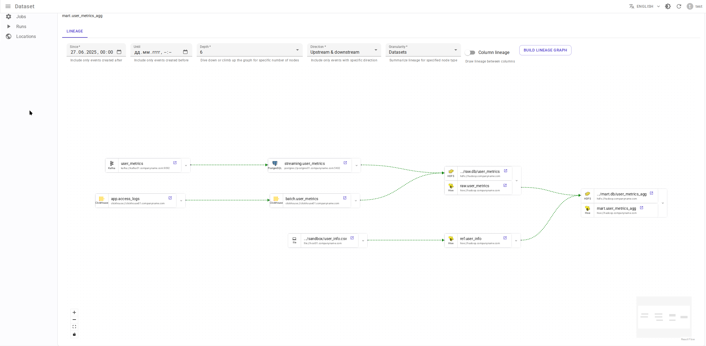
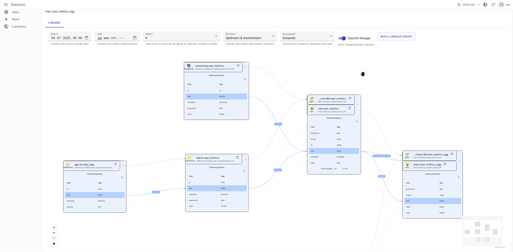
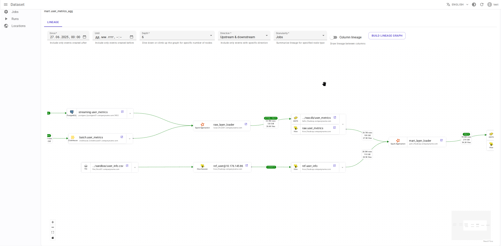
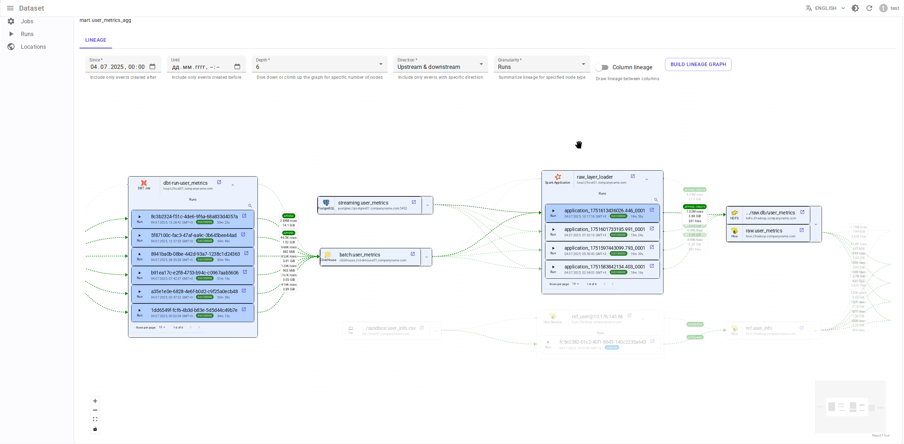

{{ datarentgen_logo_wide }}

     
  

# Что такое Data.Rentgen?

Data.Rentgen — это сервис отслеживания lineage (Data Motion Lineage), совместимый со спецификацией [OpenLineage](https://openlineage.io/).

В настоящее время мы поддерживаем получение lineage из:

* Apache Spark
* Apache Airflow
* Apache Hive
* Apache Flink
* dbt

**Примечание**: сервис находится в активной разработке, поэтому пока не имеет стабильного API.

# Цели

* Собирать события lineage, создаваемые клиентами и интеграциями OpenLineage.
* Хранить события с детальностью до операций для большей точности (вместо детализации до задач, как в [Marquez](https://marquezproject.ai/)).
* Предоставлять API для получения lineage как для случаев задача/запуск ↔ датасет, так и датасет ↔ датасет.

# Возможности

* Поддержка обработки больших объемов событий lineage с использованием Apache Kafka в качестве буфера событий.
* Хранение данных в таблицах, разделенных по временным меткам событий, для ускорения построения графа lineage.
* Граф lineage строится с пользовательскими временными границами (в отличие от Marquez, где граф строится только для последнего запуска задачи).
* Граф lineage может строиться с различной степенью детализации. Например, объединение всех отдельных команд Spark в applicationId или applicationName Spark.
* Поддержка lineage на уровне колонок.
* Поддержка аутентификации.

# Не цели

* Это **НЕ** каталог данных. DataRentgen не отслеживает изменения схем датасетов, владельцев и т.д. Вместо этого используйте [Datahub](https://datahubproject.io/) или [OpenMetadata](https://open-metadata.org/).
* Статическое происхождение данных, такое как представление → таблица, не поддерживается.

# Ограничения

* OpenLineage имеет интеграции с Trino, Debezium и другими источниками.
* В отличие от Marquez, DataRentgen анализирует только ограниченный набор фасетов, отправляемых OpenLineage, и не сохраняет пользовательские фасеты. Это может быть изменено в будущем.

# Скриншоты

## Граф lineage

Граф lineage на уровне наборов данных (dataset)

Граф lineage на уровне колонок наборов данных (dataset)

Граф lineage на уровне заданий (Job)

Граф lineage на уровне запусков Run

## Наборы данных (dataset)

## Запуски (Run)

## Приложение Spark

## Запуск Spark

## Команда Spark

## Запрос Hive

## DagRun Airflow

## TaskInstance Airflow

