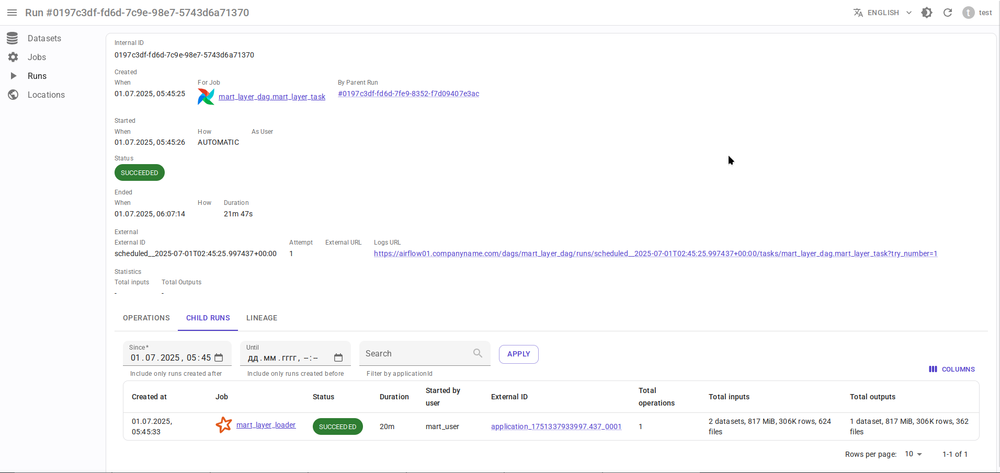

# Интеграция с Apache Airflow { #overview-setup-airflow }

Использование [интеграции OpenLineage с Apache Airflow](https://openlineage.io/docs/integrations/airflow/).

## Требования

- [Apache Airflow](https://airflow.apache.org/) 2.x или 3.x
- OpenLineage 1.19.0 или выше, рекомендуется 1.34.0+
- Интеграция OpenLineage для Airflow (см. ниже)

## Соответствие сущностей

- Airflow DAG → Data.Rentgen Job
- Airflow DAGRun → Data.Rentgen Run
- Airflow Task → Data.Rentgen Job
- Airflow TaskInstance → Data.Rentgen Run + Data.Rentgen Operation

## Установка

- Для Airflow 2.7 или выше используйте [apache-airflow-providers-openlineage](https://airflow.apache.org/docs/apache-airflow-providers-openlineage/stable/index.html) 1.9.0 или выше:

  ```console
  $ pip install "apache-airflow-providers-openlineage>=2.3.0" "openlineage-python[kafka]>=1.34.0" zstd
  ...
  ```

- Для Airflow 2.1.x-2.6.x используйте [интеграцию OpenLineage для Airflow](https://openlineage.io/docs/integrations/airflow/) 1.19.0 или выше:

  ```console
  $ pip install "openlineage-airflow>=1.34.0" "openlineage-python[kafka]>=1.34.0" zstd
  ...
  ```

## Настройка

### Через конфигурационный файл OpenLineage

- Создайте файл `openlineage.yml` с содержимым:

  ```yaml
  transport:
      type: kafka
      topic: input.runs
      config:
          bootstrap.servers: localhost:9093
          security.protocol: SASL_PLAINTEXT
          sasl.mechanism: SCRAM-SHA-256
          sasl.username: data_rentgen
          sasl.password: changeme
          compression.type: zstd
          acks: all
  ```

- Укажите путь к файлу конфигурации через переменную окружения `AIRFLOW__OPENLINEAGE__CONFIG_PATH`:

  ```ini
  AIRFLOW__OPENLINEAGE__NAMESPACE=http://airflow.hostname.fqdn:8080
  AIRFLOW__OPENLINEAGE__CONFIG_PATH=/path/to/openlineage.yml
  ```

### Через конфигурационный файл Airflow

Настройте интеграцию OpenLineage, используя файл конфигурации `airflow.cfg`:

```ini
[openlineage]
# укажите здесь адрес веб-интерфейса Airflow
namespace = http://airflow.hostname.fqdn:8080
# укажите здесь адрес подключения к Kafka и учетные данные
transport = {"type": "kafka", "config": {"bootstrap.servers": "localhost:9093", "security.protocol": "SASL_PLAINTEXT", "sasl.mechanism": "SCRAM-SHA-256", "sasl.username": "data_rentgen", "sasl.password": "changeme", "compression.type": "zstd", "acks": "all"}, "topic": "input.runs", "flush": true}
```

### Через переменные окружения Airflow

Установите переменные окружения для всех компонентов Airflow (например, через `docker-compose.yml`):

```ini
AIRFLOW__OPENLINEAGE__NAMESPACE=http://airflow.hostname.fqdn:8080
AIRFLOW__OPENLINEAGE__TRANSPORT={"type": "kafka", "config": {"bootstrap.servers": "localhost:9093", "security.protocol": "SASL_PLAINTEXT", "sasl.mechanism": "SCRAM-SHA-256", "sasl.username": "data_rentgen", "sasl.password": "changeme", "compression.type": "zstd", "acks": "all"}, "topic": "input.runs", "flush": true}
```

### Airflow 2.1.x и 2.2.x

Для Airflow 2.1-2.2 необходимо явно включить интеграцию OpenLineage, добавив запись в конфигурацию `airflow.cfg`:

```ini
[lineage]
backend=openlineage.lineage_backend.OpenLineageBackend
```

Или установив переменную окружения:

```ini
AIRFLOW__LINEAGE__BACKEND=openlineage.lineage_backend.OpenLineageBackend
```

## Сбор и отправка данных lineage

Запустите любой DAG Airflow с задачами и дождитесь завершения.
Данные о происхождении будут автоматически отправлены в Data.Rentgen с помощью интеграции OpenLineage.

## Просмотр результатов

Перейдите на страницу [Jobs](http://localhost:3000/jobs) в интерфейсе, чтобы увидеть, какая информация была извлечена OpenLineage и DataRentgen.

### Страница списка заданий (Job)


### Страница деталей запуска DAG (Run)


### Страница деталей запуска задачи


