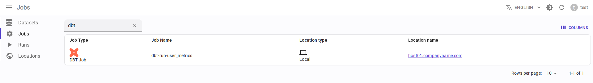

# Интеграция с dbt { #overview-setup-dbt }

Использование [интеграции OpenLineage с dbt](https://openlineage.io/docs/integrations/dbt).

## Требования

- [dbt](https://www.getdbt.com/) версии 1.3 или выше
- OpenLineage версии 1.19.0 или выше, рекомендуется 1.34.0+

## Отображение сущностей

- dbt проект → Data.Rentgen Job
- dbt запуск → Data.Rentgen Run
- dbt модель, снапшот, sql, тест → Data.Rentgen Operation

## Установка

```console
$ pip install "openlineage-dbt>=1.34.0" "openlineage-python[kafka]>=1.34.0" zstd
...
```

## Настройка

- Создайте файл `openlineage.yml` со следующим содержимым:

  ```yaml
  transport:
      type: kafka
      topic: input.runs
      config:
          bootstrap.servers: localhost:9093
          security.protocol: SASL_PLAINTEXT
          sasl.mechanism: SCRAM-SHA-256
          sasl.username: data_rentgen
          sasl.password: changeme
          compression.type: zstd
          acks: all
  ```

- Установите переменные окружения:

  ```ini
  OPENLINEAGE_NAMESPACE=local://dbt.host.name
  OPENLINEAGE_CONFIG=/path/to/openlineage.yml
  ```

## Сбор и отправка информации о происхождении данных

Замените команды CLI `dbt`:

```shell
$ dbt run myproject
...
$ dbt test myproject
...
```

на CLI `dbt-ol`:

```shell
$ dbt-ol run myproject
...
$ dbt-ol test myproject
...
```

Информация о происхождении данных будет автоматически отправлена в Data.Rentgen через интеграцию с OpenLineage.

## Просмотр результатов

Перейдите на страницу [Jobs](http://localhost:3000/jobs) в интерфейсе, чтобы увидеть, какая информация была извлечена с помощью OpenLineage и DataRentgen.

### Страница списка заданий (Job)



### Страница деталей задания (Job)


### Граф lineage для задания (Job)


### Детали запуска (Run)


### Граф lineage запуска (Run)


### Детали операции


### Граф lineage операции


