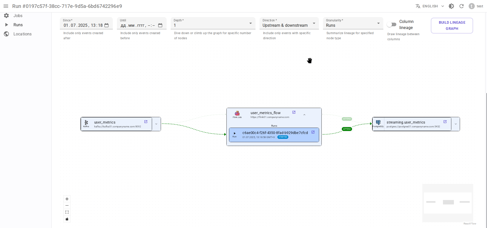

# Интеграция с Apache Flink 1.x { #overview-setup-flink1 }

Использование [интеграции OpenLineage с Apache Flink 1.x](https://openlineage.io/docs/integrations/flink/flink1).

## Требования

- [Apache Flink](https://flink.apache.org/) 1.x
- OpenLineage 1.31.0 или выше, рекомендуется 1.34.0+

## Ограничения

- Поддерживается только режим `standalone-job` (режим приложения), но не `jobmanager` (сессионный режим): [проблема OpenLineage](https://github.com/OpenLineage/OpenLineage/issues/2150)

## Сопоставление сущностей

- Задача Flink → Задание Data.Rentgen
- Запуск задачи Flink → Запуск Data.Rentgen + Операция Data.Rentgen

## Установка

- Добавьте зависимости [openlineage-flink](https://mvnrepository.com/artifact/io.openlineage/openlineage-flink) и [kafka-clients](https://mvnrepository.com/artifact/org.apache.kafka/kafka-clients) в вашу задачу Flink:

  ```groovy title="build.gradle"
  implementation "io.openlineage:openlineage-flink:1.34.0"
  implementation "org.apache.kafka:kafka-clients:3.9.0"
  ```

- Зарегистрируйте `OpenLineageFlinkJobListener` в коде вашей задачи Flink:

  ```java title="MyFlinkJob.java"
  import io.openlineage.flink.OpenLineageFlinkJobListener;

  StreamExecutionEnvironment env = StreamExecutionEnvironment.getExecutionEnvironment();

  JobListener listener = OpenLineageFlinkJobListener.builder()
      .executionEnvironment(env)
      .build();
  env.registerJobListener(listener);
  ```

## Настройка

- Измените файл `config.yaml` Flink, чтобы он включал:

  ```yaml title="config.yaml"
  execution.attached: true  # захватывать события остановки задач
  ```

- Создайте файл `openlineage.yml` с содержимым вида:

  ```yaml title="openlineage.yml"
  job:
      namespace: http://some.host.name:18081  # установите пространство имен, соответствующее адресу Flink
      name: flink_examples_stateful  # установите имя задачи

  # Отправлять событие RUNNING каждый 1 час.
  # Использование интервала по умолчанию (1 минута) просто перегружает Kafka бесполезными событиями RUNNING.
  trackingIntervalInSeconds: 3600

  transport:
      type: kafka
      topicName: input.runs
      properties:
          bootstrap.servers: broker:9092  # не используем localhost в docker
          security.protocol: SASL_PLAINTEXT
          sasl.mechanism: SCRAM-SHA-256
          sasl.jaas.config: |
              org.apache.kafka.common.security.scram.ScramLoginModule required
              username="data_rentgen"
              password="changeme";
          key.serializer: org.apache.kafka.common.serialization.StringSerializer
          value.serializer: org.apache.kafka.common.serialization.StringSerializer
          compression.type: zstd
          acks: all
  ```

- Передайте путь к файлу конфигурации через переменную окружения `OPENLINEAGE_CONFIG` для `jobmanager`:

  ```ini
  OPENLINEAGE_CONFIG=/path/to/openlineage.yml
  ```

В итоге это должно выглядеть так (см. [Официальную документацию](https://nightlies.apache.org/flink/flink-docs-release-1.20/docs/deployment/resource-providers/standalone/docker/)):

```yaml title="docker-compose.yml"
services:
    jobmanager:
        image: flink:1.20.1-scala_2.12-java11
        ports:
        - "18081:8081"
        # поддерживается только standalone-job
        command: standalone-job --job-classname my.awesome.FlinkStatefulApplication
        volumes:
        - ./artifacts/:/opt/flink/usrlib/  # путь к JAR-файлам вашей задачи Flink
        - ./config.yaml:/opt/flink/conf/config.yaml
        - ./openlineage.yml:/opt/flink/conf/openlineage.yml
        environment:
        - OPENLINEAGE_CONFIG=/path/to/openlineage.yml

    taskmanager:
        image: flink:1.20.1-scala_2.12-java11
        depends_on:
        - jobmanager
        command: taskmanager
        volumes:
        - ./artifacts/:/opt/flink/usrlib/  # путь к JAR-файлам вашей задачи Flink
        - ./config.yaml:/opt/flink/conf/config.yaml
```

## Сбор и отправка данных о происхождении данных

Просто запустите вашу задачу Flink. Интеграция OpenLineage автоматически соберет и отправит данные о происхождении в DataRentgen.

## Просмотр результатов

Просмотрите страницы интерфейса [Jobs](http://localhost:3000/jobs), чтобы увидеть, какая информация была извлечена OpenLineage и DataRentgen.

### Страница списка заданий (Job)


### Страница сведений о задании (Job)


### Страница сведений о запуске (Run)


### Lineage на уровне наборов данных (dataset)


### Lineage на уровне заданий (Job)


### Lineage на уровне запусков (Run)


