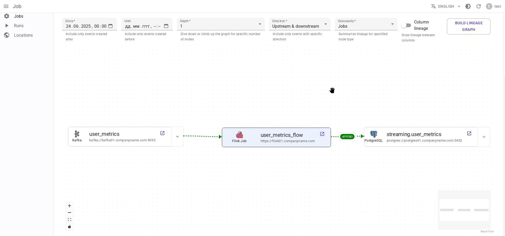

# Интеграция с Apache Flink 2.x { #overview-setup-flink2 }

Использование [интеграции OpenLineage с Apache Flink 2.x](https://openlineage.io/docs/integrations/flink/flink2).

## Требования

- [Apache Flink](https://flink.apache.org/) 2.x
- OpenLineage 1.31.0 или выше, рекомендуется 1.34.0+

## Отображение сущностей

- Job Flink → Data.Rentgen Job
- Run Flink → Data.Rentgen Run + Data.Rentgen Operation

## Установка

- Скачайте следующие jar-файлы и поместите их в директорию `openlineage/jars/`:

  - [openlineage-java](https://mvnrepository.com/artifact/io.openlineage/openlineage-java)
  - [openlineage-flink](https://mvnrepository.com/artifact/io.openlineage/openlineage-flink)
  - [kafka-clients](https://mvnrepository.com/artifact/org.apache.kafka/kafka-clients)
  - [zstd-jni](https://mvnrepository.com/artifact/com.github.luben/zstd-jni)

- Установите переменную окружения `CLASSPATH` для `JobManager` Flink, указывающую на путь к этой директории:

  ```ini
  CLASSPATH=/path/to/openlineage/jars/
  ```

- Настройте `JobManager` Flink для загрузки этих зависимостей с использованием собственного ClassLoader:

  ```yaml title="config.yaml"

  classloader.parent-first-patterns.additional: ["io.openlineage.", "org.apache.kafka.","com.github.luben."]
  ```

  В противном случае Flink загрузит все классы из загрузчика классов задания, что может привести к ошибкам типа:

  ```text
  org.apache.kafka.common.KafkaException: class org.apache.kafka.common.serialization.StringSerializer is not an instance of org.apache.kafka.common.serialization.Serializer
  java.util.ServiceConfigurationError: io.openlineage.client.transports.TransportBuilder: io.openlineage.client.transports.HttpTransportBuilder not a subtype
  ```

  Подробнее см. [документацию Flink](https://nightlies.apache.org/flink/flink-docs-release-2.0/docs/deployment/config/#class-loading).

## Настройка

- Добавьте `OpenLineageJobStatusChangedListenerFactory` в файл `config.yaml` Flink:

  ```yaml title="config.yaml"

  classloader.parent-first-patterns.additional: ["io.openlineage.", "org.apache.kafka.","com.github.luben."]
  execution.job-status-changed-listeners: io.openlineage.flink.listener.OpenLineageJobStatusChangedListenerFactory  # захват события задания
  execution.attached: true  # захват событий остановки Job
  execution.job-listener.openlineage.namespace: http://some.host.name:18081  # установите пространство имен, соответствующее адресу Flink
  execution.job-listener.openlineage.job-name: flink_examples_stateful  # установите имя Job
  ```

- Создайте файл `openlineage.yml` с содержимым вида:

  ```yaml title="openlineage.yml"

  # Отправлять событие RUNNING каждые 10 минут.
  # Использование интервала по умолчанию (1 минута) просто заполняет Kafka бесполезными событиями RUNNING.
  trackingIntervalInSeconds: 600

  transport:
      type: kafka
      topicName: input.runs
      properties:
          bootstrap.servers: broker:9092  # не используем localhost в docker
          security.protocol: SASL_PLAINTEXT
          sasl.mechanism: SCRAM-SHA-256
          sasl.jaas.config: |
              org.apache.kafka.common.security.scram.ScramLoginModule required
              username="data_rentgen"
              password="changeme";
          key.serializer: org.apache.kafka.common.serialization.StringSerializer
          value.serializer: org.apache.kafka.common.serialization.StringSerializer
          compression.type: zstd
          acks: all
  ```

- Передайте путь к файлу конфигурации через переменную окружения `OPENLINEAGE_CONFIG` для `jobmanager`:

  ```ini
  OPENLINEAGE_CONFIG=/path/to/openlineage.yml
  ```

В итоге это должно выглядеть так (см. [Официальную документацию](https://nightlies.apache.org/flink/flink-docs-release-2.0/docs/deployment/resource-providers/standalone/docker/)):

```yaml title="docker-compose.yml"

services:
    jobmanager:
        image: flink:2.0.0-scala_2.12-java11
        ports:
        - "18081:8081"
        # поддерживаются как standalone-job, так и jobmanager
        command: standalone-job --job-classname my.awesome.FlinkStatefulApplication
        volumes:
        - ./artifacts/:/opt/flink/usrlib/  # путь к файлам .jar вашего задания Flink, если используется standalone-job
        - ./config.yaml:/opt/flink/conf/config.yaml
        - ./openlineage/jars/:/opt/flink/usrlib/openlineage/
        - ./openlineage.yml:/opt/flink/conf/openlineage.yml
        environment:
        - CLASSPATH=/opt/flink/usrlib/openlineage/

    taskmanager:
        image: flink:2.0.0-scala_2.12-java11
        depends_on:
        - jobmanager
        command: taskmanager
        volumes:
        - ./artifacts/:/opt/flink/usrlib/  # путь к файлам .jar вашего задания Flink, если используется standalone-job
        - ./config.yaml:/opt/flink/conf/config.yaml
```

## Сбор и отправка lineage

Просто запустите ваш Job Flink. Интеграция OpenLineage автоматически соберет и отправит lineage в DataRentgen.

## Просмотр результатов

Просмотрите на странице [Jobs](http://localhost:3000/jobs), чтобы увидеть, какая информация была извлечена OpenLineage и DataRentgen.

### Страница списка Job


### Страница сведений о Job


### Страница сведений о запуске (Run)


### lineage на уровне набора данных (dataset)


### lineage на уровне Job



### lineage на уровне запуска (Run)


