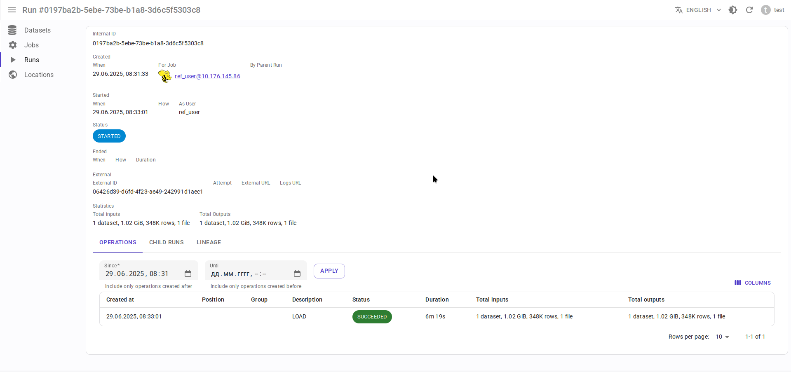
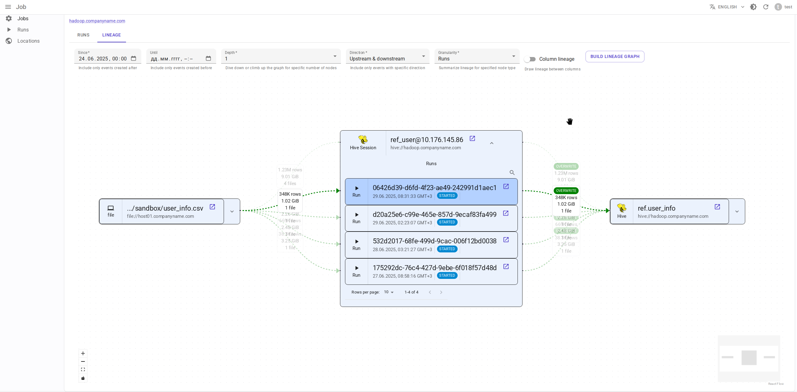

# Интеграция с Apache Hive { #overview-setup-hive }

Использует [интеграцию OpenLineage с Apache Hive](https://openlineage.io/docs/integrations/hive/).

## Требования

- [Apache Hive](https://hive.apache.org/) 3.1.3 (версия 4.0 пока не поддерживается)
- OpenLineage 1.34.0 или выше, рекомендуется 1.35.0+

## Ограничения

- **Hive CLI** не поддерживается. Требуется HiveServer2.

- В версии OpenLineage 1.34.0 как содержащие связи между данными только следующие запросы обрабатываются:

  - `CREATE TABLE .. AS SELECT ...`
  - `INSERT INTO ... SELECT ...`

  Типы запросов которые игнорируются интеграцией OpenLineage:

  - `CREATE TABLE ...`, `ALTER TABLE ...`, `TRUNCATE TABLE ...`, `DROP TABLE ...`.
  - `INSERT INTO ... VALUES ...`, `UPDATE`, `DELETE`, `MERGE`.
  - `LOAD DATA`, `EXPORT`, `IMPORT`.
  - `SELECT` с выводом данных напрямую в JDBC-клиент.

- Hive отправляет события при запуске пользовательской сессии, но не при её завершении. Поэтому все сессии Hive в Data.Rentgen имеют статус `STARTED`.

## Соответствие сущностей

- Пользователь Hive + IP пользователя → Задание (Job) в Data.Rentgen
- Сессия Hive → Запуск (Run) в Data.Rentgen
- Запрос Hive → Операция (Operation) в Data.Rentgen

## Установка

Скачайте следующие jar-файлы и поместите их в каталог `/path/to/jars/` на машине с HiveServer2:

- [openlineage-java](https://mvnrepository.com/artifact/io.openlineage/openlineage-java)
- [openlineage-hive](https://mvnrepository.com/artifact/io.openlineage/openlineage-hive)
- [kafka-clients](https://mvnrepository.com/artifact/org.apache.kafka/kafka-clients)
- [zstd-jni](https://mvnrepository.com/artifact/com.github.luben/zstd-jni)

## Настройка

Измените конфигурационный файл `hive-site.xml`:

```xml
<?xml version="1.0" encoding="UTF-8"?>
<configuration>
    <!-- Настройка Hive, чтобы не жаловался на неизвестные свойства -->
    <property>
        <name>hive.conf.validation</name>
        <value>false</value>
    </property>

    <!-- Укажите путь к скачанным jar-файлам -->
    <property>
        <name>hive.aux.jars.path</name>
        <value>/path/to/jars/</value>
    </property>

    <!-- Включите интеграцию OpenLineage на основе хуков Hive -->
    <property>
        <name>hive.server2.session.hook</name>
        <value>io.openlineage.hive.hooks.HiveOpenLineageHook</value>
    </property>
    <property>
        <name>hive.exec.post.hooks</name>
        <value>io.openlineage.hive.hooks.HiveOpenLineageHook</value>
    </property>
    <property>
        <name>hive.exec.failure.hooks</name>
        <value>io.openlineage.hive.hooks.HiveOpenLineageHook</value>
    </property>

    <!-- Настройка транспорта OpenLineage через Kafka -->
    <property>
        <name>hive.openlineage.transport.type</name>
        <value>kafka</value>
    </property>
    <property>
        <name>hive.openlineage.transport.topicName</name>
        <value>input.runs</value>
    </property>
    <property>
        <name>hive.openlineage.transport.properties.bootstrap.servers</name>
        <!-- Адрес должен быть доступен с машины HiveServer2 -->
        <value>localhost:9093</value>
    </property>
    <property>
        <name>hive.openlineage.transport.properties.security.protocol</name>
        <value>SASL_PLAINTEXT</value>
    </property>
    <property>
        <name>hive.openlineage.transport.properties.sasl.mechanism</name>
        <value>SCRAM-SHA-256</value>
    </property>
    <property>
        <name>hive.openlineage.transport.properties.sasl.jaas.config</name>
        <value>org.apache.kafka.common.security.scram.ScramLoginModule required username="data_rentgen" password="changeme";</value>
    </property>
    <property>
        <name>hive.openlineage.transport.properties.key.serializer</name>
        <value>org.apache.kafka.common.serialization.StringSerializer</value>
    </property>
    <property>
        <name>hive.openlineage.transport.properties.value.serializer</name>
        <value>org.apache.kafka.common.serialization.StringSerializer</value>
    </property>
    <property>
        <name>hive.openlineage.transport.properties.compression.type</name>
        <value>zstd</value>
    </property>
    <property>
        <name>hive.openlineage.transport.properties.acks</name>
        <value>all</value>
    </property>

    <!-- Установите пространство имен по умолчанию для задач -->
    <property>
        <name>hive.openlineage.namespace</name>
        <value>hive://my.hive.host:10000</value>
    </property>
</configuration>
```

## Сбор и отправка связей между данными

Подключитесь к интерфейсу JDBC вашего HiveServer2, например, используя `beeline` или DBeaver. После выполнения запроса интеграция отправит события связей между данными в DataRentgen.

!!! note

    По умолчанию Задание (Job) создается с именем `{username}@{clientIp}`. Вы можете переопределить это имя, выполнив следующую команду:

    ```sql
    SET hive.openlineage.job.name=my_session_name;
    ```

## Просмотр результатов

Перейдите на страницу [Задания (Jobs)](http://localhost:3000/jobs) в интерфейсе, чтобы увидеть информацию, извлеченную OpenLineage и DataRentgen.

### Страница списка задач


### Страница деталей задания (Job)


### Страница деталей запуска



### Страница деталей операции


### Связи на уровне набора данных


### Связи на уровне задачи


### Связи на уровне запуска



### Связи на уровне операции


