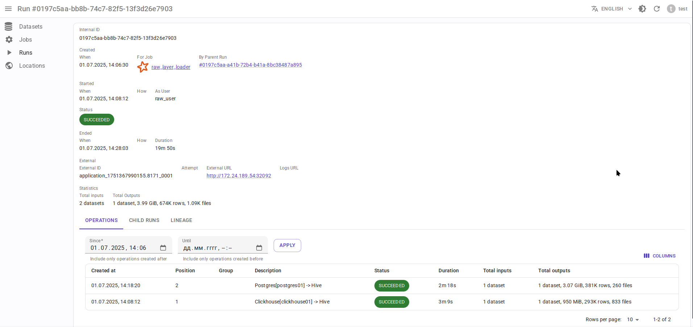

# Интеграция с Apache Spark { #overview-setup-spark }

Использует [интеграцию OpenLineage с Apache Spark](https://openlineage.io/docs/integrations/spark/).

## Требования

- [Apache Spark](https://spark.apache.org/) 3.x или выше
- OpenLineage 1.23.0 или выше, рекомендуется 1.34.0+

## Соответствие сущностей

- Spark applicationName → Задача (Job) в Data.Rentgen
- Spark applicationId → Запуск (Run) в Data.Rentgen
- Spark job, execution, RDD → Операция (Operation) в Data.Rentgen

## Настройка

### Через файл конфигурации OpenLineage

- Создайте файл `openlineage.yml` со следующим содержимым:

  ```yaml
  transport:
      type: kafka
      topicName: input.runs
      properties:
          bootstrap.servers: localhost:9093
          security.protocol: SASL_PLAINTEXT
          sasl.mechanism: SCRAM-SHA-256
          sasl.jaas.config: |
              org.apache.kafka.common.security.scram.ScramLoginModule required
              username="data_rentgen"
              password="changeme";
          key.serializer: org.apache.kafka.common.serialization.StringSerializer
          value.serializer: org.apache.kafka.common.serialization.StringSerializer
          compression.type: zstd
          acks: all
  ```

- Передайте путь к файлу конфигурации через переменную окружения `OPENLINEAGE_CONFIG`:

  ```ini
  OPENLINEAGE_NAMESPACE=local://hostname.as.fqdn
  OPENLINEAGE_CONFIG=/path/to/openlineage.yml
  ```

- Настройте `OpenLineageSparkListener` через конфигурацию SparkSession:

```python
from pyspark.sql import SparkSession

spark = (
    SparkSession.builder
    # установка интеграции OpenLineage и клиента Kafka
    .config(
        "spark.jars.packages",
        "io.openlineage:openlineage-spark_2.12:1.34.0,org.apache.kafka:kafka-clients:3.9.0",
    )
    .config(
        "spark.extraListeners", "io.openlineage.spark.agent.OpenLineageSparkListener"
    )
    # установка мастера и имени приложения Spark
    .master("local")
    .appName("mysession")
    # несколько других важных опций
    .config("spark.openlineage.jobName.appendDatasetName", "false")
    .config("spark.openlineage.columnLineage.datasetLineageEnabled", "true")
    .getOrCreate()
)
```

### Через конфигурацию `SparkSession`

Добавьте пакет интеграции OpenLineage, настройте `OpenLineageSparkListener` в конфигурации SparkSession:

```python
from pyspark.sql import SparkSession

spark = (
    SparkSession.builder
    # установка интеграции OpenLineage и клиента Kafka
    .config(
        "spark.jars.packages",
        "io.openlineage:openlineage-spark_2.12:1.34.0,org.apache.kafka:kafka-clients:3.9.0",
    )
    .config(
        "spark.extraListeners", "io.openlineage.spark.agent.OpenLineageSparkListener"
    )
    # установка мастера и имени приложения Spark
    .master("local")
    .appName("mysession")
    # укажите расположение сессии Spark, например, текущий хост, кластер YARN или K8s:
    .config("spark.openlineage.namespace", "local://hostname.as.fqdn")
    # .config("spark.openlineage.namespace", "yarn://some-cluster")
    # .config("spark.openlineage.namespace", "k8s://some-cluster")
    .config("spark.openlineage.transport.type", "kafka")
    # укажите адрес подключения и учетные данные Kafka
    .config("spark.openlineage.transport.topicName", "input.runs")
    .config(
        "spark.openlineage.transport.properties.bootstrap.servers", "localhost:9093"
    )
    .config(
        "spark.openlineage.transport.properties.security.protocol", "SASL_PLAINTEXT"
    )
    .config("spark.openlineage.transport.properties.sasl.mechanism", "SCRAM-SHA-256")
    .config(
        "spark.openlineage.transport.properties.sasl.jaas.config",
        'org.apache.kafka.common.security.scram.ScramLoginModule required username="data_rentgen" password="changeme";',
    )
    .config("spark.openlineage.transport.properties.acks", "all")
    .config(
        "spark.openlineage.transport.properties.key.serializer",
        "org.apache.kafka.common.serialization.StringSerializer",
    )
    .config(
        "spark.openlineage.transport.properties.value.serializer",
        "org.apache.kafka.common.serialization.StringSerializer",
    )
    .config("spark.openlineage.transport.properties.compression.type", "zstd")
    # несколько других важных опций
    .config("spark.openlineage.jobName.appendDatasetName", "false")
    .config("spark.openlineage.columnLineage.datasetLineageEnabled", "true")
    .getOrCreate()
)
```

## Сбор и отправка связей между данными

- Используйте `SparkSession` как контекстный менеджер, чтобы правильно обрабатывать события остановки сессии:

```python
with SparkSession.builder.getOrCreate() as spark:
    # работа с spark внутри этого контекста
```

- Выполните некоторые операции с данными, используя Spark, например:

```python
df = spark.read.format("jdbc").options(...).load()
df.write.format("csv").save("/output/path")
```

Связи между данными будут автоматически отправлены в Data.Rentgen через `OpenLineageSparkListener`.

## Просмотр результатов

Перейдите на страницу ["Задания" (Jobs)](http://localhost:3000/jobs) в интерфейсе, чтобы увидеть информацию, извлеченную OpenLineage и DataRentgen.

### Страница списка заданий (Job)


### Страница деталей задания (Job)


### Страница деталей запуска (Run)



### Страница деталей операции


### Связи на уровне набора данных (dataset)


### Связи на уровне столбцов набора данных (dataset)


### Связи на уровне задания (Job)


### Связи на уровне запуска (Run)


### Связи на уровне операции


