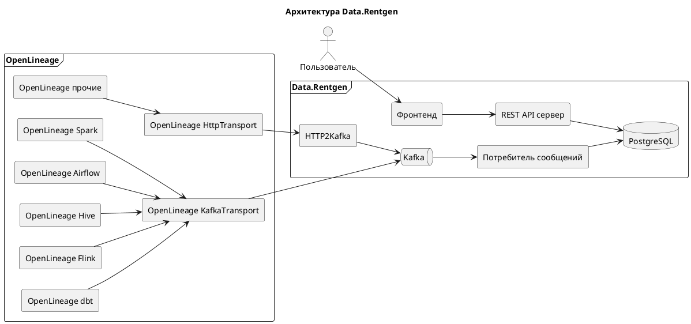

# Архитектура { #Architecture }

## Компоненты

Data.Rentgen построен с использованием следующих компонентов:

- Клиенты [OpenLineage](https://openlineage.io/docs/) и интеграции со сторонними модулями (например, Apache Spark, Apache Airflow).
- [`message-broker`][message-broker], получающий события в формате JSON.
- [`message-consumer`][message-consumer], обрабатывающий JSON-сообщения.
- [`database`][database] для хранения обработанных и очищенных данных.
- [`server`][server], предоставляющий данные из базы данных.
- [`frontend`][frontend], обращающийся к REST API для навигации по созданным сущностям и графу линейности.
- [`http2kafka`][http2kafka] (опционально), прокси для отправки событий OpenLineage в Kafka через HTTP API.

## Диаграмма архитектуры

