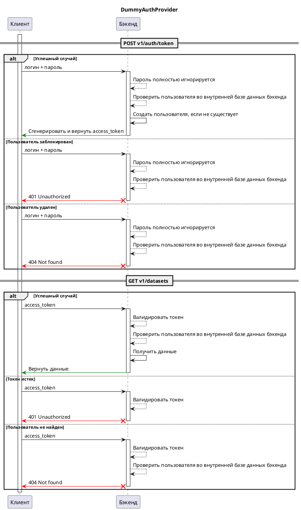

# Фиктивный провайдер аутентификации { #auth-server-dummy }

## Описание

Этот провайдер аутентификации позволяет войти в систему с любым именем пользователя и паролем, а затем выдает токен доступа.

После успешной аутентификации имя пользователя сохраняется в базе данных бэкенда.

## Схема взаимодействия

## Конфигурация

::: data_rentgen.server.settings.auth.dummy.DummyAuthProviderSettings

::: data_rentgen.server.settings.auth.jwt.JWTSettings
