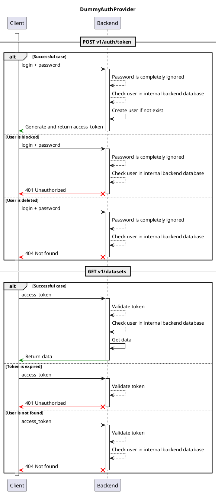

# Dummy Auth provider { #auth-server-dummy }

## Description

This auth provider allows to sign-in with any username and password, and and then issues an access token.

After successful auth, username is saved to backend database.

## Interaction schema

## Configuration

::: data_rentgen.server.settings.auth.dummy.DummyAuthProviderSettings

::: data_rentgen.server.settings.auth.jwt.JWTSettings
