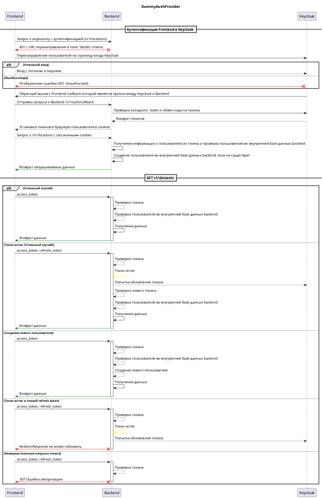

# Провайдер Keycloak { #auth-server-keycloak }

## Описание

Провайдер аутентификации Keycloak использует библиотеку [python-keycloak](https://pypi.org/project/python-keycloak/) для взаимодействия с сервером Keycloak. В процессе аутентификации KeycloakAuthProvider перенаправляет пользователя на страницу аутентификации Keycloak.

После успешной аутентификации Keycloak перенаправляет пользователя обратно в Data.Rentgen с кодом авторизации.
Затем KeycloakAuthProvider обменивает код авторизации на токен доступа и использует его для получения информации о пользователе с сервера Keycloak.
Если пользователь не найден в базе данных Data.Rentgen, KeycloakAuthProvider создает его. Наконец, KeycloakAuthProvider возвращает пользователя с токеном доступа.

## Схема взаимодействия

## Базовая конфигурация

::: data_rentgen.server.settings.auth.keycloak.KeycloakAuthProviderSettings

::: data_rentgen.server.settings.auth.keycloak.KeycloakSettings
